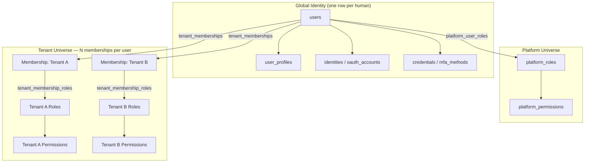

# Assumptions and Scope

## Project goal

Build an enterprise-grade identity/auth/authz system supporting: platform-level users and permissions; tenant-level users and permissions; users belonging to multiple tenants; multiple roles per tenant membership; hierarchical RBAC; resource ownership; team and department access; permission inheritance and overrides; secure support impersonation; OAuth/OIDC social login; future ABAC and external policy-engine integration; strict cross-tenant isolation. Must suit thousands of tenants and potentially millions of users.

## Confirmed assumptions

All items below (A1–A10) were presented to the user and explicitly confirmed. They are load-bearing for every later phase — do not silently deviate from them.

| # | Assumption | Rationale |
|---|---|---|
| A1 | Single shared PostgreSQL cluster, shared schema, discriminator-column multi-tenancy (not DB-per-tenant or schema-per-tenant) | Only model that scales cleanly to thousands of tenants / millions of users without linear ops overhead. Comparison table in [07-tenant-isolation-and-rls.md](07-tenant-isolation-and-rls.md). |
| A2 | "Platform" and "Tenant" are disjoint authorization universes with separate role/permission tables — no shared rows, no shared cache namespace | Prevents accidental permission bleed at the schema level, not just app-logic level |
| A3 | Access tokens are JWT, short-lived (10–15 min), stateless-verifiable; refresh tokens are opaque, rotating, stored hashed, DB-backed (stateful, revocable) | Balances horizontal scalability (stateless access checks) with real revocation (refresh layer) |
| A4 | Active tenant context is **never** a long-lived JWT claim — resolved per-request and re-validated against `tenant_memberships` on every call | A JWT claim can outlive a revoked membership; a claim is a *hint*, not an *authorization* |
| A5 | Redis is a performance cache and rate-limit store only — never the sole source of truth for auth decisions | Redis unavailability must degrade to "deny" or "verified DB read," never "allow" |
| A6 | Initial identity providers: local password + Google OIDC + Facebook Login. Architecture must admit Entra ID / Okta / SAML / SCIM without redesign | Keeps the IdP strategy extensible from day one |
| A7 | Deployment target is containerized (Docker), horizontally scaled API pods + separate worker pods, single primary Postgres initially with read-replica readiness | No assumption of a specific orchestrator beyond containers |
| A8 | "Thousands of tenants, millions of users" is a target ceiling, not day-1 load — schema/indexes are designed for that ceiling; infra (replicas, sharding) scales into it over time | Avoids premature infra complexity while keeping the data model correct from day one |
| A9 | Support impersonation is platform-initiated only; a tenant user can never impersonate another tenant user | Matches the "never allow direct use of a tenant account" requirement |
| A10 | ABAC / external policy engine (e.g., OPA/Cedar) is a future extension point, not built now — the permission model is designed so conditions/attributes can be added without a data-model rewrite | Matches the "future ABAC" requirement without over-building today |

## User confirmations on record

- Tenancy model: **shared schema + RLS for all tenants** (not schema-per-tenant, not an isolated-tier variant — at least for now).
- Tenant resolution: **verified subdomain/custom domain as primary**, with fallback strategies as designed.
- A5–A10: **confirmed as-is**, no adjustments requested.

See [08-decisions-log.md](08-decisions-log.md) for the full reasoning behind each.

## Platform vs Tenant user/admin boundary

Two identity universes share one `users` table (a person has one global identity) but authorization is fully partitioned. A platform role can only ever be linked to platform permissions; a tenant role can only ever be linked to tenant permissions — enforced at three layers: (1) separate tables with no FK path between them, (2) a schema/trigger-level guard rejecting cross-scope inserts, (3) application-layer validation before any role-permission assignment.

A platform user with zero tenant memberships has **no implicit access** to any tenant's resources. Cross-tenant platform actions must go through explicit platform services, never through "platform user therefore superuser."

## Platform-User vs Tenant-User Responsibility Matrix

| Capability | Platform User | Tenant User | Notes |
|---|---|---|---|
| Create/suspend tenants | Yes (`platform.tenants.*`) | No | |
| Manage own tenant's roles/members | No (not without impersonation) | Yes (`tenant.roles.manage`, if granted) | Platform never edits tenant RBAC directly |
| View cross-tenant billing/usage aggregates | Yes (`platform.billing.manage`) | No | |
| View own tenant's billing | No | Yes (Tenant Owner/Billing role) | |
| Configure AI provider credentials for a tenant | No (cannot see tenant secrets) | Yes (Tenant/AI Administrator) | Platform manages platform-level provider integrations, not tenant secrets |
| Impersonate a tenant user for support | Yes (`platform.support.impersonate`, audited, time-boxed) | No | See [06-authorization-model.md](06-authorization-model.md) |
| Read tenant conversation content | No (never, even via impersonation without explicit reason/approval) | Yes (within own tenant, per role) | Impersonation audit is tenant-visible |
| Manage platform feature flags | Yes (`platform.features.manage`) | No | |
| Enable a feature flag for their own tenant (if plan allows) | No | Yes (Tenant Administrator, if `tenant.settings.manage` + plan entitlement) | Platform sets the ceiling; tenant toggles within it |
| View platform-wide audit logs | Yes (`platform.audit.view`) | No | |
| View own tenant's audit log | No | Yes (`tenant.audit.view`) | Disjoint audit views, same underlying `audit_logs` table filtered by tenant_id |
| Create custom tenant roles | No | Yes (Tenant Owner/Admin, bounded by assignable permission set) | Tenant custom roles can never include platform permissions |
