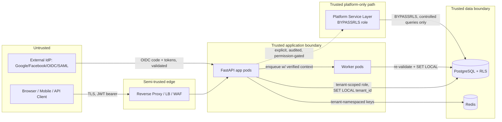

# Threat Model

## Trust Boundaries

Key boundary statements:

- Everything left of the load balancer is **untrusted input** — including JWT claims, which are only *cryptographically authentic*, not necessarily *currently valid* (a claim can be authentic and stale).
- The **only** code path allowed to bypass Row-Level Security is the Platform Service Layer, itself gated by `platform.*` permissions and fully audited. Application code and worker code always run under the tenant-scoped, RLS-enforced DB role.
- Redis is inside the trusted data boundary but is **not authoritative** — it is a derived cache, invalidated by permission-version bumps, and the app must fail closed if it cannot confirm freshness.

## STRIDE Threat Table

| Threat | Vector | Primary Mitigation |
|---|---|---|
| **S**poofing | Forged/stolen JWT; OAuth state/nonce omission; subdomain spoofing | Signature+exp+aud+iss validation every request; mandatory state/nonce/PKCE on OIDC; tenant resolved from *verified* domain record, not raw Host header trust alone |
| **T**ampering | Client sends `tenant_id`/`role`/`user_id` in body/header/query and expects it trusted | Deny-by-default: every tenant-scoped write re-derives tenant/user from server-validated session + membership, never from client-supplied identifiers |
| **R**epudiation | Admin denies performing a destructive action; audit log edited post-hoc | Append-only `audit_logs` (DB-level revoke UPDATE/DELETE grants on that table; app role has INSERT-only), actor + effective-user + correlation ID captured server-side |
| **I**nformation Disclosure | IDOR (guess another tenant's resource ID); vector search leaking cross-tenant chunks; verbose 404 vs 403 enabling enumeration | Composite `(tenant_id, resource_id)` lookups only; RLS as backstop; generic 404 for "not found OR not yours"; server-injected tenant filter on every vector query |
| **D**enial of Service | Login brute force; token-refresh storms; cache stampede on permission recompute | Rate limiting + progressive lockout on login; refresh-token family reuse triggers full revocation not just error; cache stampede lock/jitter on permission recompute |
| **E**levation of Privilege | Self-assignment of a role the actor doesn't hold; custom tenant role granted a platform permission; role-hierarchy cycle granting unintended inheritance; impersonation escalated to persistent access | Actor can only grant permissions that are a subset of their own effective permissions; DB-level scope separation (platform vs tenant tables); hierarchy-depth + cycle validation on write; impersonation sessions are time-boxed, single-purpose, and cannot themselves grant/modify roles |

## Cross-Tenant & Privilege-Escalation Scenarios

These are **mandatory test cases** in Phase 8 (Tests and security validation) — each one must have a corresponding automated negative test proving the defense holds.

**Phase 8 status: all 12 have automated tests.** The "Proven by" column below is the audit trail; `tests/security/README.md` carries the same mapping from the test side. Two of these defenses did not actually exist when Phase 8 started and were built during it — see the ⚠ rows.

| # | Scenario | Required Defense | Proven by |
|---|---|---|---|
| 1 | User in Tenant A edits request body/header `tenant_id` to Tenant B's ID | Active tenant is resolved+validated server-side against membership; body/header tenant hints are ignored or must match, never authoritative | `tests/security/test_scenarios.py::TestScenario01TenantHintTampering`; HTTP-level in `tests/api/test_ai_resource_authorization.py::TestTenantScopingAtTheRouteBoundary` |
| 2 | User in Tenant A guesses a sequential/UUID resource ID belonging to Tenant B | Every query is `WHERE tenant_id = :verified_tenant AND id = :id`; RLS denies even if app filter is missed; response is 404, not 403, to avoid existence leakage | `tests/integration/db/test_ai_resources_rls.py` (DB half); `TestScenario02CrossTenantIdor` (error-shape half) |
| 3 | Tenant Admin creates a custom role and tries to attach `platform.tenants.suspend` to it | Rejected at role-permission assignment — tenant roles can only reference `tenant_permissions` (schema + app validation) | `TestScenario03PlatformPermissionInTenantRole` |
| 4 | Member with `tenant.roles.manage` tries to assign themselves "Tenant Owner" (self-escalation) | Grantable-permission check: actor may only assign roles whose permission set is a subset of the actor's own effective permissions, plus explicit "cannot self-modify to a higher role" guard | `TestScenario04SelfEscalation`; full coverage in `tests/unit/tenant_authz/` |
| 5 | Tenant Membership is suspended mid-session; user's still-valid JWT keeps working | Membership status re-checked server-side each request (not cached beyond permission-version TTL); suspension bumps permission version, forcing a cache miss and DB check | `TestScenario05SuspendedMembershipMidSession` |
| 6 | Refresh token stolen and used after the legitimate client already rotated it | Reuse detection: any refresh of an already-rotated token revokes the entire token family + flags a security event | `TestScenario06RefreshTokenReuse`; `tests/unit/identity/test_refresh_session.py` |
| 7 | Vector DB query for assistant knowledge base omits tenant filter, returning cross-tenant chunks | Vector namespace is server-derived and mandatory (`tenant_id:kb_id`), never client-suppliable; query builder cannot construct a filterless query | `TestScenario07VectorNamespaceIsolation`; `tests/unit/ai_resources/test_knowledge_base_and_secrets.py` |
| 8 | Background job (e.g., document embedding) enqueued for Tenant A runs after context bleeds from a prior job for Tenant B on a reused worker | Worker sets tenant context (`SET LOCAL`) per-job inside its own transaction and clears it on completion; jobs carry verified tenant_id/actor_id in payload, re-validated against DB at execution time, not trusted from enqueue time alone | ✅ **Covered as of Phase 11.** Both halves now proven. *Context isolation:* `TestScenario08WorkerContextBleed` asserts the transaction-scoped `set_config` mechanism, and scenario 12 proves it behaviourally under real pooled reuse. *Per-job re-validation:* `tests/security/test_worker_job_revalidation.py` (9 tests, live Postgres) proves `workers/job_context.py` refuses a job whose tenant was suspended, whose membership was suspended or revoked, or whose user account was suspended or deleted **between enqueue and execution** — the time-of-check-to-time-of-use window a queue backlog or retry opens. It also proves a payload claiming a tenant the actor has no membership in is refused, and that the RLS context is set from the *claimed* tenant before any validation query runs, so a hostile payload never executes a query with more reach than the identity it claims. |
| 9 | Impersonation session used to modify tenant roles or export data beyond the stated support reason | Impersonation scope is read/support-limited by permission set of a dedicated impersonation context, distinct from the target user's own permissions; all actions tagged with `impersonation_session_id` in audit | ⚠ **Defense was missing; built in Phase 8.** `domain/impersonation/policies.py` + `TestScenario09ImpersonationScope`. Audit tagging with `impersonation_session_id` remains outstanding. |
| 10 | Custom tenant role references a permission that requires a plan/feature the tenant doesn't have | Permission has `required_plan`/`required_feature`; effective-permission calculation intersects with tenant's active entitlements | `TestScenario10FeatureEntitlement` (`required_feature` only — `required_plan` needs `tenant_subscriptions`, still deferred) |
| 11 | Attacker registers with an email matching an existing OAuth-linked account to hijack it | No auto-merge by email — linking requires an authenticated session explicitly initiating the link, with re-auth | `TestScenario11OAuthEmailHijack` |
| 12 | Row-Level Security is accidentally bypassed because a pooled connection retains a prior request's `SET` session variable | `SET LOCAL` only (transaction-scoped, auto-reset on commit/rollback) + session-per-request pattern, never `SET` (session-scoped) — see [07-tenant-isolation-and-rls.md](07-tenant-isolation-and-rls.md) | `tests/integration/db/test_rls_isolation.py::TestPoolReuse` (live Postgres, `pool_size=1`); `TestScenario12PooledConnectionContext` |
| 13 | A tenant admin points a crawl at an internal address — the cloud metadata service, a loopback port, a private-network host — and has the worker fetch it and index the response into a knowledge base they can then read back (SSRF) | Scheme allowlist (http/https only); DNS resolution followed by an address check on **every** resolved address, not the hostname; loopback, link-local, multicast, reserved and (by default) private ranges refused; non-web ports blocked; the check runs on the submitted URL **and again inside the crawl loop** on every redirect and discovered link — see [`infrastructure/crawling/url_safety.py`](../src/iam_platform/infrastructure/crawling/url_safety.py) | ✅ **Covered as of Phase 12.** `tests/security/test_crawl_ssrf_guard.py` (30 tests: metadata endpoints, loopback, IPv4-mapped IPv6, private ranges, `file://`/`gopher://`, non-web ports, plus a positive control and a check that refusal messages don't echo resolved IPs back as a network-mapping oracle). `tests/unit/ai_resources/test_web_crawler.py` proves a **same-host** unsafe link discovered mid-crawl is skipped before any fetch — mutation-tested by removing the in-loop guard and confirming the tests fail. **Residual risk:** DNS rebinding (a name resolving public at check time and private at connect time) is not closed; doing so needs the connection pinned to the validated address inside crawl4ai's transport. |
| 14 | A crawl job's authorization goes stale mid-run — the tenant is suspended or the membership revoked an hour into a two-hour crawl — and the worker keeps fetching and indexing | Same per-job re-validation as document ingestion: RLS context set from the *claimed* tenant first, then tenant → membership → user validated, so the validating queries themselves run with no more reach than the identity claimed | ✅ **Covered as of Phase 12.** `tests/security/test_crawl_job_revalidation.py` (6 tests against live Postgres: suspended tenant, revoked membership, suspended user, deleted user, cross-tenant payload, plus a positive control proving an authorized job *does* reach the crawler — without which every refusal could be passing because the job always raises) |
| 15 | A chat-widget session token — handed to **every visitor of a tenant's public website** — is used to authenticate against the tenant administration API | Widget tokens are minted under a **separate JWT audience** (`JWT__WIDGET_AUDIENCE`). `PyJwtService.verify` pins the console audience and `WidgetTokenService.verify` pins the widget one, so PyJWT rejects each token at the other verifier before any application code runs. Widget claims carry **no user id, membership or permissions** — a visitor is not a user, and there is no field for code to mistakenly resolve as one | ✅ **Covered as of Phase 13B.** `tests/security/test_widget_token_isolation.py` (8 tests) proves refusal in **both** directions, that the two audiences differ, and that the claims dataclass has no user field. **Mutation-tested:** setting the audiences equal makes the boundary tests fail |
| 16 | An anonymous caller uses a widget's public key to read a *different* knowledge base, or another tenant's | The visitor never names a tenant or knowledge base: both are read off the widget row at session issuance, and the retrieval namespace is rebuilt from the widget's own ids on every question. The widget is **re-read on every question**, not just at session start, so disabling it or repointing it takes effect immediately rather than as 30-minute sessions expire; a token whose `kb` claim no longer matches the row is refused | ✅ **Covered as of Phase 13B.** `tests/security/test_public_widget_surface.py` (14 tests): disabled mid-session, origin removed mid-session, token naming another knowledge base, namespace derived from the row, and the command dataclass having no namespace or tenant field |
| 17 | A widget key is copied onto an attacker's site, or hammered by a script, running up embedding/rerank/generation costs on the platform's bill | Per-widget origin allowlist (exact match, no wildcards — a naive suffix match also accepts `evil-example.com`; empty allowlist permits nothing) plus a per-widget **daily question cap** enforced in Redis **before** generation, and the existing per-IP rate-limit middleware. The quota store **fails closed**: an unconfirmable limit refuses the question rather than becoming unlimited | ⚠️ **Partially covered, and the limit is stated deliberately.** The origin allowlist is real against a *browser* — page JavaScript cannot forge `Origin` — so it does stop another website embedding the widget. It is **not** a defence against a non-browser client, which can send any `Origin` it likes. Against that, the daily cap and rate limiting are the actual controls, and they bound cost rather than preventing abuse. Tested: quota refuses before the pipeline runs; origin rejection covers the `evil-help.acme.test` suffix case |

### STRIDE repudiation mitigation — also fixed in Phase 8

The STRIDE table above specifies append-only `audit_logs` with "DB-level revoke UPDATE/DELETE grants on that table; app role has INSERT-only". **Those grants were never applied.** `ALTER DEFAULT PRIVILEGES` in `docker/postgres-init/01-roles.sql` hands every newly created table full CRUD to `app_tenant`, and no migration narrowed it — verified against the live database, which showed `app_tenant` holding DELETE, INSERT, SELECT and UPDATE on `audit_logs`. A compromised application connection could therefore have erased the record of what it did.

Fixed by migration `937a69c41b65`, which revokes UPDATE/DELETE/TRUNCATE on `audit_logs` and `security_events` from both `app_tenant` and `app_platform`. Guarded by `tests/security/test_append_only_audit.py`, which checks both the grants and the behaviour — the default-privileges rule means a future table re-creation would silently reopen the hole.
