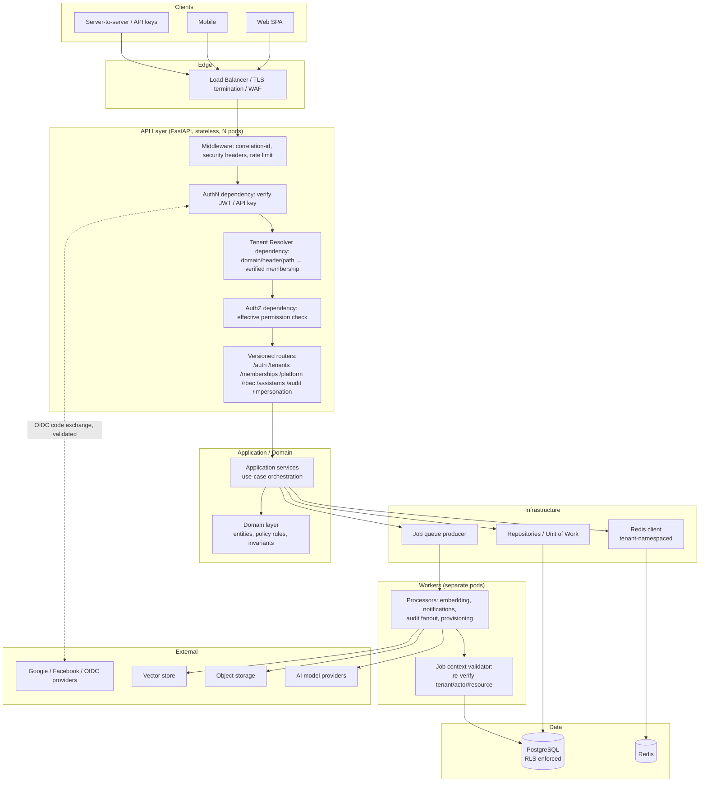

# System Architecture

## Module boundary rules (binding for Phase 4 folder structure)

- `api` depends on `application`.
- `application` depends on `domain`.
- `domain` depends on nothing (pure — entities, policy rules, invariants only).
- `infrastructure` implements ports defined by `domain`/`application` (repositories, Redis client, queue producer).
- `core` (config, security primitives, request-context) is depended on by everything but depends on nothing project-specific.
- `workers` depends on `application`/`infrastructure`, never on `api`.

Repositories and a light Unit-of-Work pattern are used where they provide real value for centralizing tenant-scoping enforcement — not as a heavy generic abstraction hiding SQLAlchemy 2.0's async session semantics. See the trade-off entry in [08-decisions-log.md](08-decisions-log.md).

## Request-scoped context

Every request carries a context object populated by the dependency chain (see [06-authorization-model.md](06-authorization-model.md)) holding: current user, session, active tenant, membership, platform and tenant roles, authentication method, request/correlation IDs, IP and user agent, impersonation context, and other security attributes. No global mutable state is used anywhere in the system.
