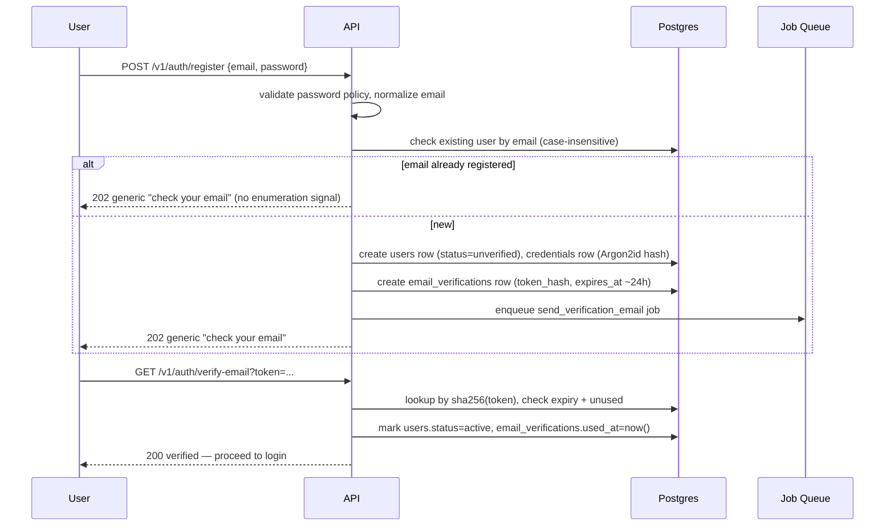
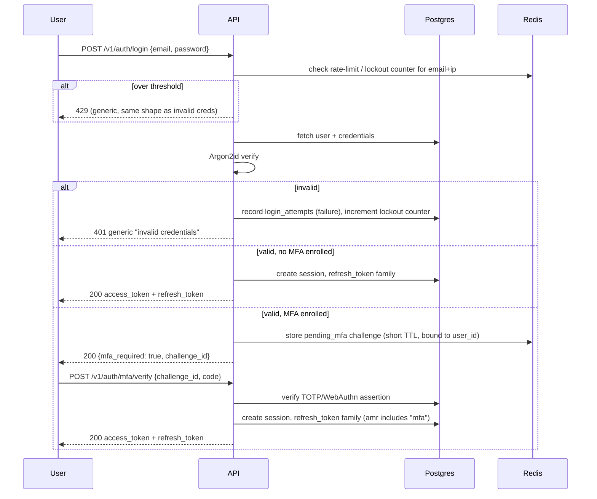

# Authentication Flows

## Token Structures

**Access token (JWT, RS256/EdDSA, 10–15 min TTL):**

```json
{
  "sub": "<user_id>",
  "sid": "<session_id>",
  "jti": "<token_id>",
  "iss": "https://auth.yourapp.com",
  "aud": "yourapp-api",
  "iat": 1735900000,
  "exp": 1735900900,
  "auth_time": 1735899000,
  "amr": ["pwd"],
  "act": null
}
```

No `tenant_id`, no roles, no permissions in the access token (see A4 in [01-assumptions-and-scope.md](01-assumptions-and-scope.md)). The `act` (actor) claim — `{ "sub": "<platform_user_id>", "imp_sid": "<impersonation_session_id>" }` — is present only during impersonation; see [06-authorization-model.md](06-authorization-model.md).

**Refresh token:** opaque random 256-bit value, never a JWT. Only `sha256(token)` is stored.

```
refresh_tokens(
  id, user_id, session_id, family_id,
  token_hash, issued_at, expires_at,
  rotated_at, replaced_by_id,   -- null until rotated
  revoked_at, revoked_reason,   -- 'rotated' | 'reuse_detected' | 'logout' | 'admin'
  ip, user_agent
)
```

`family_id` is stable across the whole rotation chain — this is what makes reuse detection possible (below).

**Tenant session state** (for clients without a resolvable subdomain, post-login tenant selection): short-lived, server-side, keyed by `session_id`, never a JWT claim. See [07-tenant-isolation-and-rls.md](07-tenant-isolation-and-rls.md).

## Registration + Email Verification



Same response shape whether or not the email exists (prevents account enumeration). Verification tokens are single-use, hashed at rest like refresh tokens.

## Password Login + MFA Step-Up



Login failures and lockouts are recorded in `login_attempts`/`account_lockouts` regardless of which step failed, so a login without completing MFA never yields tokens.

## Refresh Rotation + Reuse Detection

```mermaid
sequenceDiagram
    participant U as Client
    participant API
    participant PG as Postgres

    U->>API: POST /v1/auth/refresh {refresh_token}
    API->>PG: lookup by sha256(token)
    alt not found
        API-->>U: 401 invalid_token
    else found but revoked_at is set
        Note over API,PG: Token was already rotated or revoked —<br/>this is a REPLAY of an old token
        API->>PG: revoke ALL tokens in this family_id
        API->>PG: revoke session; write security_events (reuse_detected)
        API-->>U: 401 — force full re-login
    else found, active, not expired
        API->>PG: mark this token revoked_at=now(), reason='rotated'
        API->>PG: insert new refresh_token (same family_id, replaced_by linked)
        API->>API: issue new access_token
        API-->>U: 200 new access_token + new refresh_token
    end
```

The `family_id` linkage is what makes "one token used twice" detectable: legitimate rotation always consumes the *current* token and issues a new one, so if the *old, already-rotated* token shows up again, it's provably a stolen copy — the whole family is burned rather than just the one token, since we can't know which of the two holders (legitimate client vs attacker) is which.

## OAuth/OIDC Linking & Unlinking Safeguards

```mermaid
sequenceDiagram
    participant U as User (Browser)
    participant API
    participant IDP as Google/Facebook
    participant PG as Postgres

    U->>API: GET /v1/auth/oauth/google/start
    API->>API: generate state, nonce, PKCE verifier; store server-side (short TTL)
    API-->>U: redirect to IdP with state, nonce, code_challenge
    U->>IDP: authenticate
    IDP-->>U: redirect back with code, state
    U->>API: GET /v1/auth/oauth/google/callback?code&state
    API->>API: verify state matches stored value (CSRF check)
    API->>IDP: exchange code (+PKCE verifier) for tokens
    API->>API: verify id_token signature, iss, aud, exp, nonce
    API->>PG: lookup oauth_accounts by (provider, subject)
    alt existing oauth_account
        API->>PG: issue session for linked user
    else no existing link
        alt user is authenticated (linking flow)
            API->>PG: create oauth_accounts row linked to current user (explicit action)
        else new user
            API->>PG: create user + oauth_accounts (no auto-merge by email)
        end
    end
    API-->>U: access_token, refresh_token
```

| Action | Precondition | Why |
|---|---|---|
| New user via OIDC (no existing account) | id_token validated (sig, iss, aud, exp, nonce), subject not already linked | Standard JIT account creation |
| Link OIDC to *existing logged-in* user | User must have an active authenticated session at the time of linking (not just "email matches") | Prevents an attacker who controls `victim@email.com` at a third-party IdP from silently taking over an unrelated local account by "logging in with Google" using that email |
| Unlink OIDC provider | User must have at least one other working auth method (password set, or another linked provider) remaining | Prevents users from locking themselves out |
| Login attempt where IdP email matches an existing *unlinked* local account | Never auto-merge. Show "an account with this email already exists — log in with your password and link Google from settings" | Prevents account takeover via email-only matching |

## Logout / Logout-All-Devices

- `POST /v1/auth/logout` — revokes the current session's refresh-token family + session row; access token is left to expire naturally within its short TTL (optionally added to a short-lived Redis denylist keyed by `jti` if immediate revocation is required for that specific token).
- `POST /v1/auth/logout-all` — revokes every session and refresh-token family for the user; bumps a `user.security_stamp`/global token-version so any access token issued before this moment fails a freshness check on next permission-cache lookup even before it naturally expires.

Extensibility: architecture must admit Microsoft Entra ID, Okta, Keycloak, Auth0, Apple, GitHub, generic OIDC, SAML, SCIM, tenant-enforced SSO, JIT provisioning, and tenant-specific MFA policies without redesign (A6, [01-assumptions-and-scope.md](01-assumptions-and-scope.md)).
