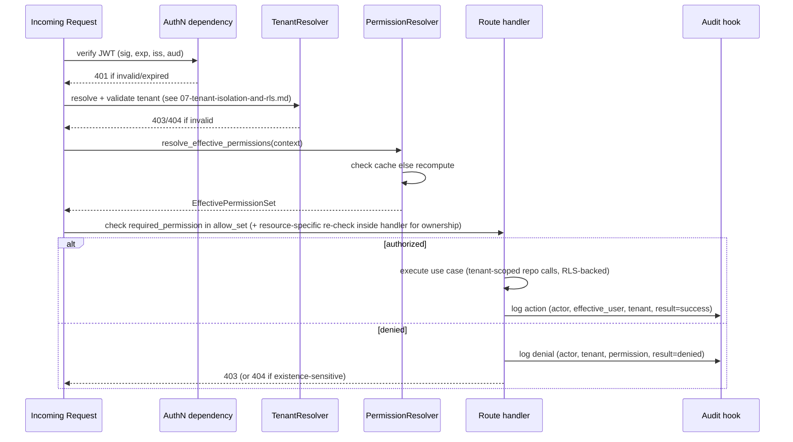

# Authorization Model

## Effective Permission Resolution Algorithm

Inputs: `actor` (platform user OR tenant membership), `resource` (optional: type + id + owner/team/department metadata), `requested_permission` (e.g. `tenant.assistants.publish`).

Design-level pseudocode (not final implementation — code lands in Phase 6):

```
function resolve_effective_permissions(context) -> EffectivePermissionSet:
    scope = context.scope                       # PLATFORM | TENANT
    subject_roles = load_roles(context)          # platform_user_roles OR tenant_membership_roles

    # 1. Expand role hierarchy safely
    expanded_roles = set()
    for role in subject_roles:
        expanded_roles |= expand_hierarchy(role, max_depth=8, visited=set())
        # expand_hierarchy raises on cycle detection (visited-set check)
        # depth cap prevents runaway/malicious hierarchy construction

    # 2. Union base permissions from all expanded roles
    allow_set = set()
    for role in expanded_roles:
        allow_set |= role.permissions            # role_permissions join, scope-consistent by construction

    # 3. Apply resource-scoped grants (ownership / team / department)
    #    These ADD narrow permissions even without a role, e.g. "resource owner"
    if resource is not None:
        allow_set |= resource_scoped_grants(context.actor, resource)

    # 4. Apply explicit overrides (authorization_overrides table)
    #    Deny always wins over allow, UNLESS a narrowly-scoped system rule says otherwise
    overrides = load_overrides(context.actor, scope)
    deny_set = {o.permission for o in overrides if o.effect == 'deny'}
    extra_allow = {o.permission for o in overrides if o.effect == 'allow'}
    allow_set = (allow_set | extra_allow) - deny_set

    # 5. Filter by plan/feature entitlement (tenant scope only)
    if scope == TENANT:
        entitlements = load_tenant_entitlements(context.tenant_id)
        allow_set = {p for p in allow_set if p.required_feature in (None, *entitlements)}

    # 6. Attach the permission_version this result is valid for
    version = current_permission_version(context)   # bumped on any role/override/membership change

    return EffectivePermissionSet(allow_set, version)
```

## Conflict Resolution (deterministic)

| Situation | Result |
|---|---|
| Role grants `X`, no override | Allow |
| Role grants `X`, explicit deny override for `X` | **Deny** (explicit deny wins) |
| No role grants `X`, explicit allow override for `X`, actor is otherwise eligible for that permission's scope | Allow (narrow, documented exception path — e.g., a one-off grant to a specific Analyst) |
| Role grants `X`, but tenant lacks `required_feature` for `X` | Deny (entitlement gate applies after role resolution) |
| Two roles disagree (one implies allow via hierarchy, none deny) | Allow (union semantics — only explicit deny removes) |

## Self-Escalation Guard

Applied at *assignment* time, not evaluation time:

```
function can_assign_role(actor, target_role, target_membership):
    if target_membership.user_id == actor.user_id and target_role.rank >= actor.highest_role.rank:
        deny("cannot elevate own access")
    if target_role.permissions - actor.effective_permissions != empty_set:
        deny("cannot grant permissions you do not hold")
    proceed
```

## Caching Strategy

| Aspect | Value |
|---|---|
| Cache key | `perm:{scope}:{tenant_id or 'platform'}:{user_id}:v{permission_version}` |
| TTL | 60–120s soft TTL (freshness bound), regardless of version match |
| Invalidation | Any role/override/membership/entitlement change increments a per-`(tenant_id,user_id)` (or per-platform-user) `permission_version` counter in Postgres; next read naturally misses the old versioned key |
| Stampede protection | Single-flight lock (`SETNX perm-lock:{key}`) around recomputation; other concurrent requests wait briefly or read the previous version with a short grace window rather than all hitting Postgres simultaneously |
| Redis unavailable | Fail closed to a direct, uncached Postgres computation for that request (never fail open to "allow"); if Postgres is also unavailable, deny with 503, not 200 |
| High-risk changes (suspension, revocation, logout-all) | Bypass cache TTL entirely — version bump is synchronous and read-your-writes within the same request that performed the change |

### Permission-Version Invalidation Triggers

| Trigger | Scope bumped |
|---|---|
| Role granted/revoked on a membership | That `(tenant_id, user_id)` |
| Tenant role's permission set edited | Every membership holding that role, in that tenant |
| Membership suspended/reactivated/revoked | That `(tenant_id, user_id)` |
| Authorization override added/removed | That `(tenant_id, user_id)` or platform-user |
| Tenant plan/entitlement changed | Every membership in that tenant |
| Platform role granted/revoked | That platform user |
| `logout-all` / password change / security event | User's global `security_stamp` (forces re-auth, superset of permission-version) |

## Per-Request Authorization Dependency Chain



The handler still re-checks resource ownership/scope where relevant (e.g., "Team Manager" permission plus "is this conversation's team one of theirs") — the dependency chain establishes tenant + coarse permission, not every resource-level condition, which stays close to the query (RLS + composite-key WHERE clause) rather than being fully abstracted away.

## Impersonation Flow

```mermaid
sequenceDiagram
    participant P as Platform Support User
    participant API
    participant PG as Postgres

    P->>API: POST /v1/platform/impersonation/start<br/>{tenant_id, target_user_id, reason}
    API->>API: require platform.support.impersonate permission
    API->>PG: verify target membership exists in tenant_id
    opt approval workflow enabled
        API->>PG: create pending approval request; wait for approver
    end
    API->>PG: create impersonation_sessions row<br/>(platform_user_id, target_user_id, tenant_id, reason, started_at, expires_at, ip)
    API-->>P: impersonation access_token<br/>{sub: target_user_id, act: {sub: platform_user_id, imp_sid}}

    P->>API: subsequent requests carry impersonation token
    API->>API: TenantResolver + PermissionResolver run against target_user_id's<br/>ACTUAL effective permissions (never platform permissions)
    API->>PG: every action logged with actor=platform_user_id (via act claim),<br/>effective_user=target_user_id, impersonation_session_id
    Note over API: UI-visible impersonation banner driven by presence of "act" claim

    P->>API: POST /v1/platform/impersonation/end
    API->>PG: impersonation_sessions.ended_at = now(), revoke impersonation token/session
```

Key properties:

- The impersonation token's `sub` is the **target user** (so authorization uses the target's real, tenant-scoped permissions — never platform permissions), while `act.sub` preserves the **original platform identity** for every audit entry.
- Session is time-boxed (`expires_at`, short — e.g. 30–60 min, renewable only by re-invoking start with a fresh reason) and independently revocable.
- Two audit trails are written: the platform-side record (`impersonation_sessions` + `audit_logs` with `platform_user_id`) and, where the tenant plan includes it, a tenant-visible entry in that tenant's own audit view.

## Failure-Mode Summary

| Failure | Behavior |
|---|---|
| Redis down | Fall back to direct Postgres computation per request; latency degrades, correctness holds |
| Postgres primary down | 503 on all authenticated routes — never serve from stale cache alone past TTL |
| Clock skew between pods | JWT validation allows small `exp`/`iat` leeway (e.g. ±30s), not more |
| Worker picks up stale job after tenant suspended mid-flight | Worker re-validates tenant/membership status at execution time, aborts job if invalid |
| Impersonation token used after `expires_at` | Rejected like any expired JWT; no separate "still works because platform user is powerful" path |
