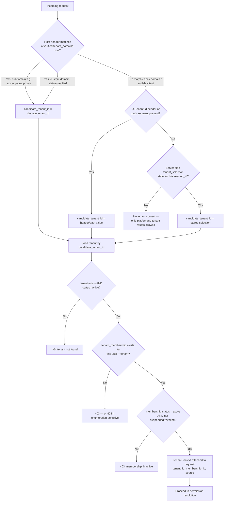

# Tenant Isolation & PostgreSQL RLS

## Tenant Resolution Algorithm

Confirmed strategy: verified subdomain/custom domain is primary; server-side authenticated selection is the fallback for clients without a resolvable domain (mobile/API).

Rules enforced by this algorithm:

- A `X-Tenant-Id` header or path value is only ever a *candidate* — it is always re-verified against real membership rows. It is never trusted on its own.
- Custom domains require `tenant_domains.status = 'verified'` (DNS TXT/CNAME challenge, detailed in Phase 3) before they can resolve a tenant — an unverified custom domain claim cannot hijack another tenant's traffic.
- Server-side tenant selection is stored against `session_id` server-side (e.g., Redis `session:{sid}:selected_tenant`), not client-suppliable, and expires with the session.
- Platform-scoped routes (`/v1/platform/*`) skip this resolver entirely — they run under a separate `PlatformContext` dependency that never touches `tenant_memberships`.

## Tenancy Model Decision

| Model | Isolation | Ops overhead at 1000s of tenants | Cross-tenant queries (platform analytics) | Verdict |
|---|---|---|---|---|
| Database-per-tenant | Strongest | Very high (connection/migration/backup fan-out) | Hard (cross-DB joins) | Reserve for a future "dedicated/enterprise" tier only, not built now |
| Schema-per-tenant | Strong | High (thousands of schemas strain catalog, migrations slow) | Hard | Not used |
| **Shared schema + `tenant_id` + RLS** | Good, defense-in-depth | Low — scales like any single-tenant app | Easy (platform role queries across tenants) | **Chosen — confirmed by user** |

## Tenant Isolation Strategy (defense-in-depth, redundant by design)

1. **Schema**: every tenant-owned table has non-null `tenant_id`; composite FKs like `(tenant_id, assistant_id)` ensure a conversation can't reference an assistant from a different tenant even if the app forgot to check.
2. **RLS**: enabled + `FORCE`d on every tenant-owned table, policy `USING (tenant_id = current_setting('app.tenant_id')::uuid)`.
3. **Application**: repositories accept a request-scoped `TenantContext` object (never a raw ID from the request) and inject it into every query.
4. **Cache**: Redis keys are `tenant:{tenant_id}:...`, never global.
5. **Object storage / vectors**: paths and namespaces are `tenant_id/...`, generated server-side, never accepted from client input.
6. **Workers**: job payloads carry a verified `tenant_id`, re-checked against the DB (membership/resource still valid) at execution time, not just at enqueue time.
7. **Tests**: cross-tenant negative tests are mandatory CI gates, not optional coverage — see [03-threat-model.md](03-threat-model.md).

## PostgreSQL RLS Mechanics

- Two DB roles: `app_tenant` (RLS-enforced, used by all normal API/worker DB access) and `app_platform` (`BYPASSRLS`, used only by the explicit Platform Service Layer, itself permission-gated and audited).
- Each request opens one DB transaction; immediately after `BEGIN`, the app issues `SET LOCAL app.tenant_id = '<verified-uuid>'; SET LOCAL app.user_id = '<uuid>';`. `SET LOCAL` is transaction-scoped — it cannot leak to the next transaction on a pooled connection even without explicit cleanup, which is why `SET` (session-scoped) is disallowed.
- Session-per-request: one `AsyncSession`/connection checkout per request, never shared across concurrent tasks; on request completion the transaction commits/rolls back and the connection returns to the pool clean.
- Workers follow the identical pattern per job: open transaction, `SET LOCAL` from the job's verified context, process, commit/rollback.
- Migrations/maintenance run as a separate superuser-like role outside RLS, never as `app_tenant` or `app_platform`.
- RLS is proven, not assumed: CI includes a test that connects as `app_tenant` with Tenant A's context and asserts zero rows returned for Tenant B data even when the application-layer filter is deliberately bypassed in the test.

Full table-by-table RLS policy definitions land in Phase 3 ([database schema doc — not yet written]).
