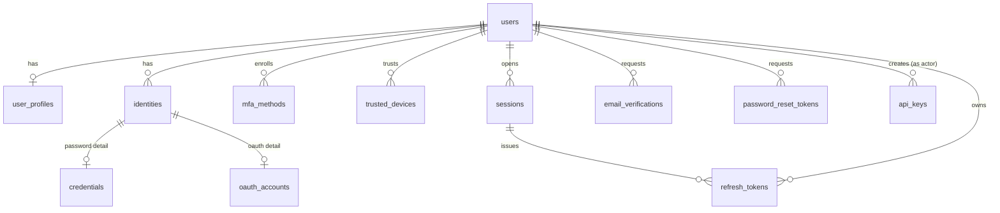

# Schema — Global Identity

Conventions in [10-schema-conventions.md](10-schema-conventions.md) apply throughout. None of these tables are tenant-owned (no `tenant_id`, no RLS) — identity is global; tenant-scoped access is layered on top via `tenant_memberships` (see [13-schema-tenant-management.md](13-schema-tenant-management.md)).

## `users`

**Purpose:** one row per human identity, global across the whole platform.

| Column | Type | Constraints |
|---|---|---|
| id | UUID | PK |
| email | CITEXT | NOT NULL, UNIQUE |
| email_verified_at | TIMESTAMPTZ | NULL |
| status | TEXT | NOT NULL, DEFAULT `'pending_verification'` |
| security_stamp | UUID | NOT NULL, DEFAULT gen_random_uuid() |
| last_login_at | TIMESTAMPTZ | NULL |
| created_at | TIMESTAMPTZ | NOT NULL |
| updated_at | TIMESTAMPTZ | NOT NULL |
| deleted_at | TIMESTAMPTZ | NULL |

- **PK:** `id`
- **Unique:** `email`
- **Check:** `status IN ('pending_verification','active','suspended','deactivated')`
- **Indexes:** unique on `email`; partial `ix_users_active WHERE deleted_at IS NULL`; `ix_users_status`
- **Tenant scoping:** none — global identity
- **Deletion behavior:** soft delete (`deleted_at`); a separate anonymization job scrubs `email`/profile PII after the retention window elapses. Never hard-deleted while `audit_logs` rows reference the ID.
- **Audit:** status transitions (suspend/deactivate), deletion requests
- **Retention:** soft-delete grace period per privacy policy (default 30 days) before anonymization; anonymized row (empty shell) retained indefinitely to preserve audit/FK integrity

`security_stamp` is bumped on password change, `logout-all`, or a security event; it backs the "revoked sessions and refresh tokens are rejected promptly" requirement (Phase 2 §7) alongside `sessions.security_stamp_snapshot`.

## `user_profiles`

**Purpose:** mutable display/profile data, 1:1 with `users`, split out so profile edits don't touch the security-sensitive `users` row.

| Column | Type | Constraints |
|---|---|---|
| user_id | UUID | PK, FK → users(id) ON DELETE CASCADE |
| display_name | TEXT | NULL |
| given_name | TEXT | NULL |
| family_name | TEXT | NULL |
| avatar_url | TEXT | NULL |
| locale | TEXT | NOT NULL, DEFAULT `'en'` |
| timezone | TEXT | NOT NULL, DEFAULT `'UTC'` |
| phone_number | TEXT | NULL |
| phone_verified_at | TIMESTAMPTZ | NULL |
| metadata | JSONB | NOT NULL, DEFAULT `'{}'` |
| created_at / updated_at | TIMESTAMPTZ | NOT NULL |

- **PK/FK:** `user_id` doubles as PK and FK to `users`
- **Tenant scoping:** none
- **Deletion behavior:** cascades on hard user deletion only (i.e. the anonymization job clears fields; cascade delete is for the eventual purge, not routine soft-delete)
- **Audit:** phone number changes (security-adjacent) are audited; display-name/avatar edits are not
- **Retention:** follows `users` retention

## `identities`

**Purpose:** lightweight summary row per authentication *method* a user has — unifies password/OAuth/WebAuthn for account-recovery UI ("which ways can I sign in?") and gives `credentials`/`oauth_accounts` a stable parent to hang audit references off.

| Column | Type | Constraints |
|---|---|---|
| id | UUID | PK |
| user_id | UUID | NOT NULL, FK → users(id) ON DELETE CASCADE |
| kind | TEXT | NOT NULL |
| created_at | TIMESTAMPTZ | NOT NULL |
| last_used_at | TIMESTAMPTZ | NULL |
| revoked_at | TIMESTAMPTZ | NULL |

- **Check:** `kind IN ('password','oauth','webauthn')`
- **Indexes:** `ix_identities_user_id`
- **Tenant scoping:** none
- **Deletion behavior:** hard delete cascades from `users`; individual unlink (see [05-authentication-flows.md](05-authentication-flows.md) unlink rule) sets `revoked_at` rather than deleting, until confirmed safe
- **Audit:** link/unlink events

## `credentials`

**Purpose:** password-specific secret for a `password`-kind identity.

| Column | Type | Constraints |
|---|---|---|
| id | UUID | PK |
| identity_id | UUID | NOT NULL, UNIQUE, FK → identities(id) ON DELETE CASCADE |
| password_hash | TEXT | NOT NULL |
| password_algo | TEXT | NOT NULL, DEFAULT `'argon2id'` |
| password_updated_at | TIMESTAMPTZ | NOT NULL |

- **Unique:** `identity_id` (1:1)
- **Tenant scoping:** none
- **Deletion behavior:** cascades with identity
- **Audit:** password changes (never log the hash or plaintext)
- **Retention:** follows `users`

## `oauth_accounts`

**Purpose:** external IdP linkage for an `oauth`-kind identity.

| Column | Type | Constraints |
|---|---|---|
| id | UUID | PK |
| identity_id | UUID | NOT NULL, UNIQUE, FK → identities(id) ON DELETE CASCADE |
| provider | TEXT | NOT NULL |
| provider_subject | TEXT | NOT NULL |
| provider_email | CITEXT | NULL |
| access_token_encrypted | BYTEA | NULL |
| refresh_token_encrypted | BYTEA | NULL |
| raw_profile | JSONB | NOT NULL, DEFAULT `'{}'` |
| linked_at | TIMESTAMPTZ | NOT NULL |

- **Unique:** `identity_id`; `(provider, provider_subject)` — a given IdP account can only ever link to one platform identity
- **Tenant scoping:** none
- **Deletion behavior:** cascades with identity; unlink flow enforces the "at least one auth method remains" rule at the application layer before deleting
- **Audit:** link/unlink
- **Retention:** provider tokens (if stored for API access) are envelope-encrypted via KMS and rotated/purged per provider token lifetime; never logged

## `email_verifications`

**Purpose:** single-use tokens for registration and email-change confirmation.

| Column | Type | Constraints |
|---|---|---|
| id | UUID | PK |
| user_id | UUID | NOT NULL, FK → users(id) ON DELETE CASCADE |
| token_hash | TEXT | NOT NULL, UNIQUE |
| purpose | TEXT | NOT NULL |
| new_email | CITEXT | NULL |
| expires_at | TIMESTAMPTZ | NOT NULL |
| used_at | TIMESTAMPTZ | NULL |
| created_at | TIMESTAMPTZ | NOT NULL |
| ip | INET | NULL |
| user_agent | TEXT | NULL |

- **Check:** `purpose IN ('register','email_change')`
- **Indexes:** unique `token_hash`; `ix_email_verifications_user_id`
- **Tenant scoping:** none
- **Deletion behavior:** hard delete via periodic cleanup job
- **Audit:** email-change completions
- **Retention:** purge 30 days after `expires_at` or `used_at`

## `password_reset_tokens`

**Purpose:** single-use password-reset tokens.

Same shape and lifecycle as `email_verifications` minus `purpose`/`new_email`: `id, user_id, token_hash (unique), expires_at, used_at, created_at, ip, user_agent`.

- **Tenant scoping:** none
- **Audit:** every reset request and completion (FR-AUDIT: "password or MFA changes")
- **Retention:** purge 30 days after expiry/use

## `mfa_methods`

**Purpose:** enrolled MFA factors (TOTP, WebAuthn, SMS backup).

| Column | Type | Constraints |
|---|---|---|
| id | UUID | PK |
| user_id | UUID | NOT NULL, FK → users(id) ON DELETE CASCADE |
| type | TEXT | NOT NULL |
| secret_encrypted | BYTEA | NULL |
| webauthn_credential_id | BYTEA | NULL |
| webauthn_public_key | BYTEA | NULL |
| sign_count | BIGINT | NOT NULL, DEFAULT 0 |
| label | TEXT | NULL |
| is_primary | BOOLEAN | NOT NULL, DEFAULT false |
| verified_at | TIMESTAMPTZ | NULL |
| created_at | TIMESTAMPTZ | NOT NULL |
| last_used_at | TIMESTAMPTZ | NULL |
| disabled_at | TIMESTAMPTZ | NULL |

- **Check:** `type IN ('totp','webauthn','sms_backup')`
- **Unique:** `(user_id, webauthn_credential_id)` where not null
- **Tenant scoping:** none
- **Deletion behavior:** soft-disable (`disabled_at`) preferred over delete, to retain enrollment history for security review
- **Audit:** enroll/disable (FR-AUDIT: MFA changes)
- **Retention:** disabled methods retained for audit trail

## `trusted_devices`

**Purpose:** "remember this device" records to skip MFA step-up for a bounded period.

`id, user_id (FK), device_fingerprint_hash, label, ip_first_seen, ip_last_seen, user_agent, trusted_until, created_at, revoked_at`.

- **Tenant scoping:** none
- **Deletion behavior:** revoked_at set on `logout-all`/security event, not deleted
- **Audit:** trust granted/revoked
- **Retention:** purge well after `trusted_until` has passed (e.g. +90 days) if never revoked

## `sessions`

**Purpose:** one row per authenticated device/browser session; the target of the JWT `sid` claim.

| Column | Type | Constraints |
|---|---|---|
| id | UUID | PK |
| user_id | UUID | NOT NULL, FK → users(id) ON DELETE CASCADE |
| created_at | TIMESTAMPTZ | NOT NULL |
| last_seen_at | TIMESTAMPTZ | NOT NULL |
| ip | INET | NULL |
| user_agent | TEXT | NULL |
| security_stamp_snapshot | UUID | NOT NULL |
| mfa_verified | BOOLEAN | NOT NULL, DEFAULT false |
| revoked_at | TIMESTAMPTZ | NULL |
| revoked_reason | TEXT | NULL |

> **Amendment (Phase 5):** `mfa_verified` was added during implementation, beyond this doc's original column list. Without it, a refreshed access token (see [05-authentication-flows.md](05-authentication-flows.md)) couldn't truthfully reissue `amr: ["pwd", "mfa"]` — the refresh flow only has the session row to work from, not the original login request, and AMR history isn't tracked anywhere else. Storing one boolean is far cheaper than a full AMR-history table for a fact ("did this session's login involve MFA") that never changes after session creation.

- **Indexes:** `ix_sessions_user_id`, `ix_sessions_revoked_at`
- **Tenant scoping:** none — a session is a device/browser concept, independent of which tenant is later selected within it
- **Deletion behavior:** hard delete via periodic cleanup well after `revoked_at`/staleness threshold
- **Audit:** creation, revocation
- **Retention:** revoked sessions retained ~90 days for forensic purposes then purged

## `refresh_tokens`

**Purpose:** rotating, hashed, family-linked refresh tokens (see [05-authentication-flows.md](05-authentication-flows.md)).

| Column | Type | Constraints |
|---|---|---|
| id | UUID | PK |
| user_id | UUID | NOT NULL, FK → users(id) ON DELETE CASCADE |
| session_id | UUID | NOT NULL, FK → sessions(id) ON DELETE CASCADE |
| family_id | UUID | NOT NULL |
| token_hash | TEXT | NOT NULL, UNIQUE |
| issued_at | TIMESTAMPTZ | NOT NULL |
| expires_at | TIMESTAMPTZ | NOT NULL |
| rotated_at | TIMESTAMPTZ | NULL |
| replaced_by_id | UUID | NULL, FK → refresh_tokens(id) |
| revoked_at | TIMESTAMPTZ | NULL |
| revoked_reason | TEXT | NULL |
| ip | INET | NULL |
| user_agent | TEXT | NULL |

- **Check:** `revoked_reason IN ('rotated','reuse_detected','logout','admin')` where not null
- **Indexes:** unique `token_hash`; `ix_refresh_tokens_family_id`; `ix_refresh_tokens_user_id`
- **Tenant scoping:** none
- **Deletion behavior:** hard delete via periodic cleanup after expiry+revocation, retained long enough for reuse-detection forensics
- **Audit:** reuse detection is a `security_events` entry, not just a row update
- **Retention:** purge ~90 days after `revoked_at`

## `api_keys`

**Purpose:** long-lived credentials for service-to-service/integration use, at either platform or tenant scope.

| Column | Type | Constraints |
|---|---|---|
| id | UUID | PK |
| owner_type | TEXT | NOT NULL |
| tenant_id | UUID | NULL, FK → tenants(id) |
| created_by_user_id | UUID | NOT NULL, FK → users(id) |
| name | TEXT | NOT NULL |
| key_prefix | TEXT | NOT NULL |
| key_hash | TEXT | NOT NULL, UNIQUE |
| scopes | TEXT[] | NOT NULL |
| last_used_at | TIMESTAMPTZ | NULL |
| expires_at | TIMESTAMPTZ | NULL |
| revoked_at | TIMESTAMPTZ | NULL |
| created_at | TIMESTAMPTZ | NOT NULL |

- **Check:** `owner_type IN ('platform','tenant')`; `ck_api_keys_tenant_consistency: (owner_type = 'tenant' AND tenant_id IS NOT NULL) OR (owner_type = 'platform' AND tenant_id IS NULL)`
- **Indexes:** unique `key_hash`; `ix_api_keys_tenant_id`
- **Tenant scoping:** RLS applies when `tenant_id` is set (standard tenant policy from [10-schema-conventions.md](10-schema-conventions.md)); platform keys (`tenant_id IS NULL`) are only manageable via the platform service layer
- **Deletion behavior:** never hard-deleted while active; revoked (`revoked_at`) and retained indefinitely for audit
- **Audit:** creation, rotation, revocation (FR-AUDIT: "API-key operations")
- **Retention:** indefinite (or per compliance policy) for revoked-key audit trail

`scopes` is validated at creation time against the creator's own effective permissions — an API key can never carry more access than its creator holds, mirroring the role self-escalation guard in [06-authorization-model.md](06-authorization-model.md).
