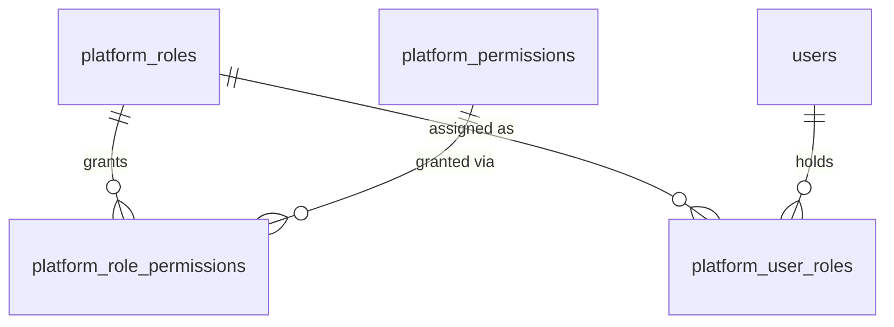

# Schema — Platform Authorization

None of these tables are tenant-owned. This is one of the two disjoint authorization universes described in [01-assumptions-and-scope.md](01-assumptions-and-scope.md) — `platform_role_permissions` physically cannot reference `tenant_permissions`, which is the schema-level guarantee behind "platform permissions must never be assignable to tenant roles."

## `platform_roles`

**Purpose:** catalog of platform-scope roles (Platform Owner, Platform Super Administrator, Platform Administrator, Platform Security Administrator, Platform Developer, Platform Support Engineer, Platform Auditor, Platform Billing Administrator, and any future system roles).

| Column | Type | Constraints |
|---|---|---|
| id | UUID | PK |
| code | TEXT | NOT NULL, UNIQUE |
| name | TEXT | NOT NULL |
| description | TEXT | NULL |
| is_system | BOOLEAN | NOT NULL, DEFAULT true |
| rank | INT | NOT NULL |
| created_at / updated_at | TIMESTAMPTZ | NOT NULL |

- **Unique:** `code`
- **Tenant scoping:** none — platform-global
- **Deletion behavior:** system roles (`is_system = true`) are never deleted, only seeded/migrated; RESTRICT on delete while any `platform_user_roles` reference exists
- **Audit:** role definition changes (rare, admin-only) are audited
- **Retention:** indefinite (reference data)

`rank` is the hierarchy-comparison value used by the self-escalation guard in [06-authorization-model.md](06-authorization-model.md) (an actor cannot grant a role with `rank >=` their own highest role's rank to themselves).

## `platform_permissions`

**Purpose:** catalog of `platform.*` permissions (e.g. `platform.tenants.create`, `platform.security.manage`).

| Column | Type | Constraints |
|---|---|---|
| id | UUID | PK |
| code | TEXT | NOT NULL, UNIQUE |
| scope | TEXT | NOT NULL, DEFAULT `'platform'` |
| resource | TEXT | NOT NULL |
| action | TEXT | NOT NULL |
| description | TEXT | NULL |
| risk_level | TEXT | NOT NULL |
| is_system | BOOLEAN | NOT NULL, DEFAULT true |
| created_at | TIMESTAMPTZ | NOT NULL |

- **Check:** `scope = 'platform'`; `risk_level IN ('low','medium','high','critical')`; `code = scope || '.' || resource || '.' || action` (validated by trigger, since generated columns can't easily concatenate three independently-editable parts safely — trigger keeps `code` and its parts consistent)
- **Unique:** `code`
- **Tenant scoping:** none
- **Deletion behavior:** system permissions are never deleted; RESTRICT while referenced by `platform_role_permissions`
- **Audit:** permission catalog changes are audited (rare, deploy-time seed data in practice)
- **Retention:** indefinite (reference data)

## `platform_role_permissions`

**Purpose:** many-to-many grant of permissions to platform roles. This table's foreign keys can *only* ever point at `platform_roles`/`platform_permissions` — there is no column, no path, that could reference a tenant role or tenant permission.

| Column | Type | Constraints |
|---|---|---|
| role_id | UUID | NOT NULL, FK → platform_roles(id) ON DELETE CASCADE |
| permission_id | UUID | NOT NULL, FK → platform_permissions(id) ON DELETE CASCADE |
| granted_at | TIMESTAMPTZ | NOT NULL |

- **PK:** `(role_id, permission_id)`
- **Tenant scoping:** none
- **Deletion behavior:** cascades if the role or permission is removed (system rows never are in practice)
- **Audit:** every add/remove is a FR-AUDIT event ("role and permission changes")
- **Retention:** indefinite

## `platform_user_roles`

**Purpose:** assignment of platform roles to specific users.

| Column | Type | Constraints |
|---|---|---|
| id | UUID | PK |
| user_id | UUID | NOT NULL, FK → users(id) ON DELETE CASCADE |
| role_id | UUID | NOT NULL, FK → platform_roles(id) ON DELETE RESTRICT |
| granted_by_user_id | UUID | NOT NULL, FK → users(id) |
| granted_at | TIMESTAMPTZ | NOT NULL |
| revoked_at | TIMESTAMPTZ | NULL |
| revoked_by_user_id | UUID | NULL, FK → users(id) |

- **Indexes:** partial unique `uq_platform_user_roles_active ON (user_id, role_id) WHERE revoked_at IS NULL`; `ix_platform_user_roles_user_id`
- **Tenant scoping:** none
- **Deletion behavior:** never hard-deleted — revoked via `revoked_at`, preserving grant history
- **Audit:** every grant/revoke (FR-AUDIT: "role and permission changes"), high-risk given platform-wide blast radius
- **Retention:** indefinite

Assignment of a `platform_user_roles` row is itself gated by the self-escalation guard: the granting actor's own effective platform permissions must be a superset of the target role's permission set (see [06-authorization-model.md](06-authorization-model.md)).
