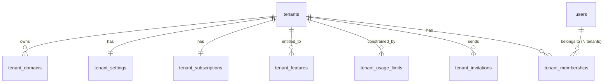

# Schema — Tenant Management

## `tenants`

**Purpose:** the tenant (organization/customer) record — the root of tenant-owned data.

| Column | Type | Constraints |
|---|---|---|
| id | UUID | PK |
| slug | TEXT | NOT NULL, UNIQUE |
| display_name | TEXT | NOT NULL |
| status | TEXT | NOT NULL, DEFAULT `'pending'` |
| owner_user_id | UUID | NOT NULL, FK → users(id) |
| region | TEXT | NULL |
| created_at / updated_at | TIMESTAMPTZ | NOT NULL |
| suspended_at | TIMESTAMPTZ | NULL |
| suspended_reason | TEXT | NULL |
| deleted_at | TIMESTAMPTZ | NULL |

- **Check:** `status IN ('pending','active','suspended','deactivated')`
- **Unique:** `slug`
- **Indexes:** unique `slug`; `ix_tenants_status`
- **Tenant scoping:** this table *is* the tenant root — every other tenant-owned table's `tenant_id` FK ultimately points here
- **Deletion behavior:** soft delete (`deleted_at`) followed by an async export-then-purge workflow honoring data retention/legal hold; `status='suspended'` is the routine access-disable lever and is fully reversible, distinct from deletion
- **Audit:** creation, suspension, deletion (FR-AUDIT: "tenant creation or suspension")
- **Retention:** per contractual/legal retention policy; export offered before purge

`region` is a forward-looking hint for future data-residency/sharding, not acted on until a multi-region deployment is scoped (Phase 9+).

## `tenant_domains`

**Purpose:** verified subdomains/custom domains used by the Tenant Resolver (see [07-tenant-isolation-and-rls.md](07-tenant-isolation-and-rls.md)).

| Column | Type | Constraints |
|---|---|---|
| id | UUID | PK |
| tenant_id | UUID | NOT NULL, FK → tenants(id) ON DELETE CASCADE |
| domain | TEXT | NOT NULL, UNIQUE |
| kind | TEXT | NOT NULL |
| status | TEXT | NOT NULL, DEFAULT `'pending_verification'` |
| verification_token | TEXT | NOT NULL |
| verified_at | TIMESTAMPTZ | NULL |
| created_at | TIMESTAMPTZ | NOT NULL |

- **Check:** `kind IN ('subdomain','custom')`; `status IN ('pending_verification','verified','failed')`
- **Unique:** `domain` — global uniqueness is intentional; two tenants can never claim the same domain
- **Tenant scoping:** tenant-owned, but the uniqueness constraint is deliberately cross-tenant
- **Deletion behavior:** hard delete allowed once a domain is unlinked; the Tenant Resolver only ever consults `status='verified'` rows, so a `pending`/`failed` row carries no access implication
- **Audit:** domain add/verify/remove
- **Retention:** indefinite while attached; removed domains logged in `audit_logs`, not retained here

## `tenant_settings`

**Purpose:** flexible tenant-level configuration.

| Column | Type | Constraints |
|---|---|---|
| tenant_id | UUID | PK, FK → tenants(id) ON DELETE CASCADE |
| settings | JSONB | NOT NULL, DEFAULT `'{}'` |
| updated_at | TIMESTAMPTZ | NOT NULL |
| updated_by_user_id | UUID | NULL, FK → users(id) |

- **Tenant scoping:** standard `tenant_id` + RLS (here `tenant_id` is the PK itself, 1:1 with `tenants`)
- **Deletion behavior:** cascades with tenant
- **Audit:** settings changes are audited when they affect security posture (e.g., SSO enforcement, session timeout policy); routine cosmetic settings are not
- **Retention:** follows tenant

## `tenant_subscriptions`

**Purpose:** current billing/plan state for a tenant. Payment instrument details are never stored here — PCI scope stays with the billing provider; this table holds only a provider reference.

| Column | Type | Constraints |
|---|---|---|
| id | UUID | PK |
| tenant_id | UUID | NOT NULL, UNIQUE, FK → tenants(id) ON DELETE CASCADE |
| plan_code | TEXT | NOT NULL |
| status | TEXT | NOT NULL |
| current_period_start | TIMESTAMPTZ | NOT NULL |
| current_period_end | TIMESTAMPTZ | NOT NULL |
| seats | INT | NULL |
| billing_provider_ref | TEXT | NULL |
| created_at / updated_at | TIMESTAMPTZ | NOT NULL |

- **Check:** `status IN ('trialing','active','past_due','canceled')`
- **Unique:** `tenant_id` (current subscription is 1:1; a historical ledger table is a Phase-9+ billing concern, out of scope here)
- **Tenant scoping:** standard
- **Deletion behavior:** cascades with tenant; status transitions are the normal lifecycle lever, not deletion
- **Audit:** plan changes, cancellation (FR-AUDIT-adjacent; billing changes should be logged)
- **Retention:** follows tenant; billing history of record lives in the billing provider, not duplicated here

## `tenant_features`

**Purpose:** feature entitlements — what `required_feature` on a permission checks against (see [06-authorization-model.md](06-authorization-model.md) step 5).

| Column | Type | Constraints |
|---|---|---|
| id | UUID | PK |
| tenant_id | UUID | NOT NULL, FK → tenants(id) ON DELETE CASCADE |
| feature_code | TEXT | NOT NULL |
| enabled | BOOLEAN | NOT NULL, DEFAULT true |
| source | TEXT | NOT NULL |
| granted_by_user_id | UUID | NULL, FK → users(id) |
| created_at | TIMESTAMPTZ | NOT NULL |

- **Check:** `source IN ('plan','override')`
- **Unique:** `(tenant_id, feature_code)`
- **Tenant scoping:** standard
- **Deletion behavior:** hard delete on entitlement removal; effective-permission cache is invalidated (permission-version bump) on any change
- **Audit:** manual overrides are audited (plan-driven entitlement sync is a system process, logged at a lower verbosity)
- **Retention:** follows tenant

## `tenant_usage_limits`

**Purpose:** quota enforcement (seats, assistants, token budgets, etc.).

| Column | Type | Constraints |
|---|---|---|
| id | UUID | PK |
| tenant_id | UUID | NOT NULL, FK → tenants(id) ON DELETE CASCADE |
| limit_code | TEXT | NOT NULL |
| limit_value | BIGINT | NOT NULL |
| current_usage | BIGINT | NOT NULL, DEFAULT 0 |
| period | TEXT | NOT NULL |
| reset_at | TIMESTAMPTZ | NULL |
| updated_at | TIMESTAMPTZ | NOT NULL |

- **Check:** `period IN ('lifetime','monthly','daily')`
- **Unique:** `(tenant_id, limit_code)`
- **Tenant scoping:** standard
- **Deletion behavior:** hard delete on limit removal
- **Audit:** limit changes (plan-driven) logged at system level; breach events feed `security_events`/application-level alerts, not this table
- **Retention:** follows tenant; `current_usage` counters are operational state, not historical — usage history for billing lives in a separate analytics pipeline, out of scope here

## `tenant_invitations`

**Purpose:** pending invitations to join a tenant.

| Column | Type | Constraints |
|---|---|---|
| id | UUID | PK |
| tenant_id | UUID | NOT NULL, FK → tenants(id) ON DELETE CASCADE |
| email | CITEXT | NOT NULL |
| invited_by_user_id | UUID | NOT NULL, FK → users(id) |
| role_ids | UUID[] | NOT NULL |
| status | TEXT | NOT NULL, DEFAULT `'pending'` |
| token_hash | TEXT | NOT NULL, UNIQUE |
| department_id | UUID | NULL, FK → departments(id) |
| team_id | UUID | NULL, FK → teams(id) |
| expires_at | TIMESTAMPTZ | NOT NULL |
| accepted_at | TIMESTAMPTZ | NULL |
| accepted_by_user_id | UUID | NULL, FK → users(id) |
| created_at | TIMESTAMPTZ | NOT NULL |

- **Check:** `status IN ('pending','accepted','revoked','expired')`
- **Unique:** `token_hash`; partial unique `(tenant_id, email) WHERE status = 'pending'` (no duplicate pending invites)
- **Indexes:** `ix_tenant_invitations_tenant_id`
- **Tenant scoping:** standard; `department_id`/`team_id` use the composite-FK pattern against `(tenant_id, id)` on those tables
- **Deletion behavior:** hard delete after long-expired + not accepted (cleanup job); accepted invitations are retained as history alongside the resulting membership
- **Audit:** sent, accepted, revoked, expired (FR-AUDIT: "invitations and membership changes")
- **Retention:** accepted/revoked invitations retained ~1 year for audit; expired-unused purged sooner

`role_ids` is validated against the inviter's own grantable permission set **at send time** and **re-validated at accept time** (entitlements/roles may have changed in between) — same self-escalation guard as direct role assignment.

## `tenant_memberships`

**Purpose:** the core join between a user and a tenant — one row per (user, tenant) relationship, carrying status, org placement, and activity metadata. This is the row the Tenant Resolver validates against on every request ([07-tenant-isolation-and-rls.md](07-tenant-isolation-and-rls.md)).

| Column | Type | Constraints |
|---|---|---|
| id | UUID | PK |
| tenant_id | UUID | NOT NULL, FK → tenants(id) ON DELETE CASCADE |
| user_id | UUID | NOT NULL, FK → users(id) ON DELETE CASCADE |
| status | TEXT | NOT NULL, DEFAULT `'invited'` |
| is_default | BOOLEAN | NOT NULL, DEFAULT false |
| department_id | UUID | NULL, FK → departments(id) |
| team_id | UUID | NULL, FK → teams(id) |
| job_title | TEXT | NULL |
| metadata | JSONB | NOT NULL, DEFAULT `'{}'` |
| invited_by_user_id | UUID | NULL, FK → users(id) |
| invited_at | TIMESTAMPTZ | NULL |
| joined_at | TIMESTAMPTZ | NULL |
| last_activity_at | TIMESTAMPTZ | NULL |
| suspended_at | TIMESTAMPTZ | NULL |
| suspended_reason | TEXT | NULL |
| revoked_at | TIMESTAMPTZ | NULL |
| revoked_reason | TEXT | NULL |
| created_at / updated_at | TIMESTAMPTZ | NOT NULL |

- **Check:** `status IN ('invited','active','suspended','revoked')`
- **Unique:** `(tenant_id, user_id)`; partial unique `(user_id) WHERE is_default = true` (at most one default tenant per user)
- **Indexes:** `ix_tenant_memberships_tenant_id`; `ix_tenant_memberships_user_id`; `ix_tenant_memberships_tenant_status ON (tenant_id, status)` (membership-listing hot path)
- **Composite FK:** `(tenant_id, department_id)` → `departments(tenant_id, id)`; `(tenant_id, team_id)` → `teams(tenant_id, id)`
- **Tenant scoping:** standard — this table is the authorization anchor: RLS + application checks both key off `(tenant_id, user_id, status)`
- **Deletion behavior:** never hard-deleted while the user or tenant exists; `status='revoked'` is terminal and retained for audit/history; a genuinely mistaken invite (never accepted) may be hard-deleted
- **Audit:** every status transition — invite, join, suspend, reactivate, revoke (FR-AUDIT: "invitations and membership changes")
- **Retention:** retained indefinitely as the historical record of who had access to a tenant and when, even after revocation
