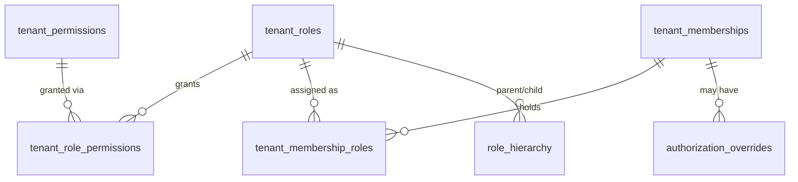

# Schema — Tenant Authorization

Mirrors [12-schema-platform-authorization.md](12-schema-platform-authorization.md) structurally, but every table here is either tenant-owned or a shared system catalog scoped for tenant use only — `tenant_role_permissions` can only reference `tenant_roles`/`tenant_permissions`, never the platform tables, giving the same schema-level scope separation in the other direction.

## `tenant_roles`

**Purpose:** catalog of tenant-scope roles — both platform-seeded system roles (Tenant Owner, Tenant Administrator, Security Administrator, AI Administrator, Knowledge Manager, Integration Manager, Department Manager, Team Manager, Agent Builder, Analyst, Auditor, Member, Read-Only User) and tenant-created custom roles.

| Column | Type | Constraints |
|---|---|---|
| id | UUID | PK |
| tenant_id | UUID | NULL, FK → tenants(id) ON DELETE CASCADE |
| code | TEXT | NOT NULL |
| name | TEXT | NOT NULL |
| description | TEXT | NULL |
| is_system | BOOLEAN | NOT NULL, DEFAULT false |
| rank | INT | NOT NULL |
| created_by_user_id | UUID | NULL, FK → users(id) |
| created_at / updated_at | TIMESTAMPTZ | NOT NULL |

- **Unique:** `uq_tenant_roles_code` on `(COALESCE(tenant_id, '00000000-0000-0000-0000-000000000000'::uuid), code)` — treats all system rows (`tenant_id IS NULL`) as one uniqueness bucket, custom rows as scoped per tenant
- **Check:** `ck_tenant_roles_system: (tenant_id IS NULL AND is_system) OR (tenant_id IS NOT NULL AND NOT is_system)` — a row is either a global system role or a tenant-owned custom role, never both
- **Tenant scoping:** system rows (`tenant_id IS NULL`) are readable by every tenant but writable only via platform-managed seed/migration; custom rows are strictly tenant-owned and RLS-scoped (RLS policy allows `tenant_id IS NULL OR tenant_id = current_setting('app.tenant_id')`)
- **Deletion behavior:** system roles never deleted; custom roles RESTRICT-deleted while `tenant_membership_roles` reference them
- **Audit:** custom role creation/edit/delete (FR-AUDIT: "role and permission changes")
- **Retention:** indefinite

## `tenant_permissions`

**Purpose:** the global catalog of `tenant.*` permissions (e.g. `tenant.assistants.publish`), shared across all tenants — not tenant-owned itself. Availability per tenant is controlled by `tenant_customizable`, `required_plan`, `required_feature`.

| Column | Type | Constraints |
|---|---|---|
| id | UUID | PK |
| code | TEXT | NOT NULL, UNIQUE |
| resource | TEXT | NOT NULL |
| action | TEXT | NOT NULL |
| description | TEXT | NULL |
| risk_level | TEXT | NOT NULL |
| is_system | BOOLEAN | NOT NULL, DEFAULT true |
| tenant_customizable | BOOLEAN | NOT NULL, DEFAULT false |
| required_plan | TEXT | NULL |
| required_feature | TEXT | NULL |
| created_at | TIMESTAMPTZ | NOT NULL |

- **Check:** `risk_level IN ('low','medium','high','critical')`; `code = 'tenant.' || resource || '.' || action` (trigger-validated)
- **Unique:** `code`
- **Tenant scoping:** none — global catalog; per-tenant applicability is computed at effective-permission time (see [06-authorization-model.md](06-authorization-model.md) step 5)
- **Deletion behavior:** system permissions never deleted; RESTRICT while referenced
- **Audit:** catalog changes (deploy-time, rare)
- **Retention:** indefinite

## `tenant_role_permissions`

**Purpose:** many-to-many grant of tenant permissions to tenant roles — physically cannot reference platform tables.

| Column | Type | Constraints |
|---|---|---|
| role_id | UUID | NOT NULL, FK → tenant_roles(id) ON DELETE CASCADE |
| permission_id | UUID | NOT NULL, FK → tenant_permissions(id) ON DELETE CASCADE |
| granted_at | TIMESTAMPTZ | NOT NULL |

- **PK:** `(role_id, permission_id)`
- **Trigger check:** if the referenced role is a custom role (`tenant_roles.tenant_id IS NOT NULL`), the permission must have `tenant_customizable = true` and satisfy that tenant's current `tenant_features`/`tenant_subscriptions` entitlement — checked both at write time and re-verified at effective-permission read time, since entitlements can later be revoked
- **Tenant scoping:** inherited from `role_id`'s owning role (system vs. tenant-specific); RLS policy on this table filters via a join-based `USING` clause against `tenant_roles.tenant_id`
- **Deletion behavior:** cascades with role
- **Audit:** every add/remove (FR-AUDIT: "role and permission changes")
- **Retention:** indefinite

## `tenant_membership_roles`

**Purpose:** assignment of tenant roles to a specific membership — the mechanism behind "multiple roles per tenant membership."

| Column | Type | Constraints |
|---|---|---|
| id | UUID | PK |
| tenant_id | UUID | NOT NULL, FK → tenants(id) ON DELETE CASCADE |
| membership_id | UUID | NOT NULL, FK → tenant_memberships(id) ON DELETE CASCADE |
| role_id | UUID | NOT NULL, FK → tenant_roles(id) |
| granted_by_user_id | UUID | NOT NULL, FK → users(id) |
| granted_at | TIMESTAMPTZ | NOT NULL |
| revoked_at | TIMESTAMPTZ | NULL |

- **Composite FK:** `(tenant_id, membership_id)` → `tenant_memberships(tenant_id, id)`, guaranteeing the membership belongs to the same tenant
- **Trigger check:** `role_id` must reference either a system role (`tenant_roles.tenant_id IS NULL`) or a custom role belonging to the *same* `tenant_id` as this row — a straight composite FK can't express the "OR NULL" case, so this is enforced by a `BEFORE INSERT/UPDATE` trigger
- **Indexes:** partial unique `(membership_id, role_id) WHERE revoked_at IS NULL`; `ix_tenant_membership_roles_tenant_id`
- **Tenant scoping:** `tenant_id` is denormalized here specifically so RLS can apply directly without a join
- **Deletion behavior:** never hard-deleted — revoked via `revoked_at`, preserving grant history for `access_reviews`
- **Audit:** every grant/revoke (FR-AUDIT: "role and permission changes")
- **Retention:** indefinite

Assignment is gated by the self-escalation guard in [06-authorization-model.md](06-authorization-model.md): granting actor's effective tenant permissions must be a superset of the target role's permissions, and an actor may never elevate their own membership to a role with `rank >=` their current highest role.

## `role_hierarchy`

**Purpose:** parent/child inheritance edges between roles, scope-homogeneous (platform roles only inherit from platform roles; same for tenant roles).

| Column | Type | Constraints |
|---|---|---|
| id | UUID | PK |
| parent_role_id | UUID | NOT NULL |
| child_role_id | UUID | NOT NULL |
| role_scope | TEXT | NOT NULL |
| created_at | TIMESTAMPTZ | NOT NULL |

- **Check:** `role_scope IN ('platform','tenant')`; `ck_role_hierarchy_no_self_loop: parent_role_id <> child_role_id`
- **Unique:** `(parent_role_id, child_role_id)`
- **Trigger check:** both `parent_role_id` and `child_role_id` must exist in the table matching `role_scope` (`platform_roles` or `tenant_roles`, and if tenant-scoped, both roles must belong to the same tenant or be system roles)
- **Cycle prevention:** a straight CHECK constraint cannot detect transitive (multi-hop) cycles; enforced at the application/service layer via a depth-bounded graph traversal before insert (max depth 8, per the `expand_hierarchy` pseudocode in [06-authorization-model.md](06-authorization-model.md)). A periodic integrity job additionally verifies no cycle exists as a backstop.
- **Tenant scoping:** N/A directly (edges reference roles, which carry their own scoping); RLS is not applied to this table directly — access is gated by role-management permissions, not tenant-row ownership, since a row can link two system roles
- **Deletion behavior:** hard delete on hierarchy edit
- **Audit:** hierarchy changes (FR-AUDIT: "role and permission changes"), high-risk since it can silently expand effective permissions
- **Retention:** indefinite

## `authorization_overrides`

**Purpose:** explicit allow/deny grants outside normal role assignment — narrow exceptions, not a replacement for RBAC.

| Column | Type | Constraints |
|---|---|---|
| id | UUID | PK |
| scope | TEXT | NOT NULL |
| tenant_id | UUID | NULL, FK → tenants(id) ON DELETE CASCADE |
| subject_type | TEXT | NOT NULL |
| subject_id | UUID | NOT NULL |
| platform_permission_id | UUID | NULL, FK → platform_permissions(id) |
| tenant_permission_id | UUID | NULL, FK → tenant_permissions(id) |
| effect | TEXT | NOT NULL |
| resource_type | TEXT | NULL |
| resource_id | UUID | NULL |
| reason | TEXT | NOT NULL |
| created_by_user_id | UUID | NOT NULL, FK → users(id) |
| expires_at | TIMESTAMPTZ | NULL |
| created_at | TIMESTAMPTZ | NOT NULL |
| revoked_at | TIMESTAMPTZ | NULL |

- **Check:** `scope IN ('platform','tenant')`; `subject_type IN ('membership','platform_user')`; `effect IN ('allow','deny')`; `ck_overrides_scope_consistency: (scope = 'platform' AND tenant_id IS NULL AND subject_type = 'platform_user' AND platform_permission_id IS NOT NULL AND tenant_permission_id IS NULL) OR (scope = 'tenant' AND tenant_id IS NOT NULL AND subject_type = 'membership' AND tenant_permission_id IS NOT NULL AND platform_permission_id IS NULL)`
- **Tenant scoping:** RLS applies when `scope = 'tenant'` (standard tenant policy); platform-scope rows are only visible via the platform service layer
- **Deletion behavior:** never hard-deleted — expired/revoked rows retained for audit; a periodic job may archive very old expired overrides
- **Audit:** every override create/revoke (FR-AUDIT: "role and permission changes"), always high-risk given it bypasses normal role assignment
- **Retention:** indefinite while unexpired; long retention after expiry/revocation for audit trail

Deny always wins over allow at evaluation time, per the conflict-resolution table in [06-authorization-model.md](06-authorization-model.md), except for the narrowly-documented "explicit allow overrides an entitlement gap for a specific actor" exception described there.
