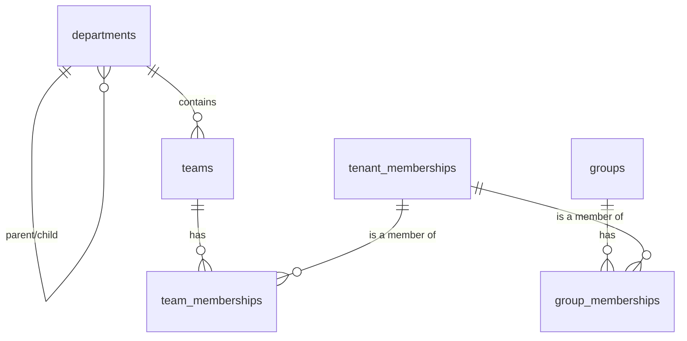

# Schema — Organization

Departments and teams are the org-chart used by `tenant_memberships.department_id`/`team_id` and by AI-resource visibility rules (department/team-scoped assistants, [16-schema-ai-resources.md](16-schema-ai-resources.md)). Groups are an orthogonal, cross-cutting membership mechanism for resource sharing independent of the org chart, and the `kind='dynamic'` option is the designated future hook for ABAC-driven membership.

## `departments`

**Purpose:** tenant org-chart node, optionally hierarchical.

| Column | Type | Constraints |
|---|---|---|
| id | UUID | PK |
| tenant_id | UUID | NOT NULL, FK → tenants(id) ON DELETE CASCADE |
| name | TEXT | NOT NULL |
| parent_department_id | UUID | NULL, FK → departments(id) |
| created_at / updated_at | TIMESTAMPTZ | NOT NULL |

- **Unique:** `uq_departments_tenant_id_id ON (tenant_id, id)` (supports composite FKs from children); `(tenant_id, name, parent_department_id)` to prevent duplicate sibling names
- **Composite FK:** `parent_department_id` paired with `tenant_id` references `departments(tenant_id, id)`, so a department can't be reparented to a different tenant's department
- **Tenant scoping:** standard
- **Deletion behavior:** RESTRICT while child departments, teams, or memberships reference it; a department being removed must be reassigned first (application-level workflow)
- **Audit:** creation/deletion (membership-impacting)
- **Retention:** follows tenant

## `teams`

**Purpose:** tenant org-chart node beneath a department (or standalone).

| Column | Type | Constraints |
|---|---|---|
| id | UUID | PK |
| tenant_id | UUID | NOT NULL, FK → tenants(id) ON DELETE CASCADE |
| department_id | UUID | NULL |
| name | TEXT | NOT NULL |
| created_at / updated_at | TIMESTAMPTZ | NOT NULL |

- **Unique:** `uq_teams_tenant_id_id ON (tenant_id, id)`
- **Composite FK:** `(tenant_id, department_id)` → `departments(tenant_id, id)`
- **Tenant scoping:** standard
- **Deletion behavior:** RESTRICT while `team_memberships` or team-scoped resources (e.g. `ai_assistants.team_id`) reference it
- **Audit:** creation/deletion
- **Retention:** follows tenant

## `team_memberships`

**Purpose:** which memberships belong to which team (distinct from `tenant_memberships.team_id`, which records a user's *primary* team — this table supports belonging to multiple teams).

| Column | Type | Constraints |
|---|---|---|
| id | UUID | PK |
| tenant_id | UUID | NOT NULL |
| team_id | UUID | NOT NULL |
| membership_id | UUID | NOT NULL |
| role_in_team | TEXT | NULL |
| added_at | TIMESTAMPTZ | NOT NULL |

- **Composite FK:** `(tenant_id, team_id)` → `teams(tenant_id, id)`; `(tenant_id, membership_id)` → `tenant_memberships(tenant_id, id)`
- **Check:** `role_in_team IN ('lead','member')` where not null
- **Unique:** `(team_id, membership_id)`
- **Tenant scoping:** `tenant_id` denormalized for direct RLS
- **Deletion behavior:** hard delete on removal from team
- **Audit:** team membership changes (moderate — feeds access decisions for team-scoped assistants)
- **Retention:** follows tenant

## `groups`

**Purpose:** cross-cutting, non-org-chart grouping for resource sharing (e.g., "share this knowledge base with Group X"); `kind='dynamic'` groups compute membership from a stored query rather than explicit rows, reserved for future ABAC integration.

| Column | Type | Constraints |
|---|---|---|
| id | UUID | PK |
| tenant_id | UUID | NOT NULL, FK → tenants(id) ON DELETE CASCADE |
| name | TEXT | NOT NULL |
| kind | TEXT | NOT NULL, DEFAULT `'static'` |
| query_definition | JSONB | NULL |
| created_at | TIMESTAMPTZ | NOT NULL |

- **Check:** `kind IN ('static','dynamic')`; `ck_groups_dynamic_query: (kind = 'dynamic' AND query_definition IS NOT NULL) OR (kind = 'static' AND query_definition IS NULL)`
- **Unique:** `(tenant_id, name)`
- **Tenant scoping:** standard
- **Deletion behavior:** RESTRICT while referenced by resource-sharing grants
- **Audit:** creation/deletion
- **Retention:** follows tenant

`query_definition` is intentionally opaque JSON at this phase (not evaluated anywhere yet) — it exists purely so the schema doesn't need to change when dynamic/attribute-based group membership is implemented later, matching the "future ABAC" requirement without building the evaluator now.

## `group_memberships`

**Purpose:** explicit membership rows for `kind='static'` groups.

| Column | Type | Constraints |
|---|---|---|
| id | UUID | PK |
| tenant_id | UUID | NOT NULL |
| group_id | UUID | NOT NULL |
| membership_id | UUID | NOT NULL |
| added_at | TIMESTAMPTZ | NOT NULL |

- **Composite FK:** `(tenant_id, group_id)` → `groups(tenant_id, id)`; `(tenant_id, membership_id)` → `tenant_memberships(tenant_id, id)`
- **Unique:** `(group_id, membership_id)`
- **Tenant scoping:** `tenant_id` denormalized for direct RLS
- **Deletion behavior:** hard delete on removal
- **Audit:** not routinely audited unless the group grants access to a sensitive resource (application-level decision at resource-sharing time)
- **Retention:** follows tenant
