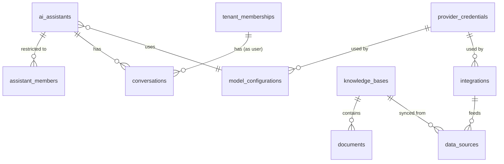

# Schema — AI Resources

Every path from a client to model output or stored knowledge crosses a tenant-owned row here; the tenant-scoped vector namespace and object-storage path pattern (`tenant_id/...`) implement the Phase 1 §12 requirement that "vector queries must always use server-generated tenant and resource filters."

## `ai_assistants`

**Purpose:** an assistant/agent configuration, tenant-owned, with visibility rules matching Phase 1 §12 policies (department/team-scoped, restricted-with-explicit-assignment).

| Column | Type | Constraints |
|---|---|---|
| id | UUID | PK |
| tenant_id | UUID | NOT NULL, FK → tenants(id) ON DELETE CASCADE |
| name | TEXT | NOT NULL |
| description | TEXT | NULL |
| visibility | TEXT | NOT NULL, DEFAULT `'tenant'` |
| department_id | UUID | NULL |
| team_id | UUID | NULL |
| owner_membership_id | UUID | NOT NULL |
| model_configuration_id | UUID | NOT NULL |
| status | TEXT | NOT NULL, DEFAULT `'draft'` |
| system_prompt | TEXT | NULL |
| created_at / updated_at | TIMESTAMPTZ | NOT NULL |

- **Check:** `visibility IN ('tenant','department','team','restricted')`; `status IN ('draft','published','archived')`
- **Unique:** `uq_ai_assistants_tenant_id_id ON (tenant_id, id)`
- **Composite FK:** `(tenant_id, department_id)` → `departments(tenant_id, id)`; `(tenant_id, team_id)` → `teams(tenant_id, id)`; `(tenant_id, owner_membership_id)` → `tenant_memberships(tenant_id, id)`; `(tenant_id, model_configuration_id)` → `tenant_model_configurations(tenant_id, model_configuration_id)` — **the entitlement, not the configuration** (see `tenant_model_configurations` below)
- **Tenant scoping:** standard; `visibility='department'|'team'` additionally filters at query time against the requester's own `department_id`/`team_id`, and `visibility='restricted'` requires an `assistant_members` row (Phase 1 §12: "restricted assistants require explicit assignment")
- **Deletion behavior:** soft-archive via `status='archived'` preferred; hard delete RESTRICT while `conversations` reference it
- **Audit:** publish/unpublish, visibility changes (FR-AUDIT: "assistant access changes")
- **Retention:** follows tenant

## `assistant_members`

**Purpose:** explicit per-user access grants for `visibility='restricted'` assistants.

| Column | Type | Constraints |
|---|---|---|
| id | UUID | PK |
| tenant_id | UUID | NOT NULL |
| assistant_id | UUID | NOT NULL |
| membership_id | UUID | NOT NULL |
| access_level | TEXT | NOT NULL |
| added_at | TIMESTAMPTZ | NOT NULL |

- **Check:** `access_level IN ('viewer','editor','owner')`
- **Composite FK:** `(tenant_id, assistant_id)` → `ai_assistants(tenant_id, id)`; `(tenant_id, membership_id)` → `tenant_memberships(tenant_id, id)`
- **Unique:** `(assistant_id, membership_id)`
- **Tenant scoping:** `tenant_id` denormalized for direct RLS
- **Deletion behavior:** hard delete on access revocation
- **Audit:** grant/revoke (FR-AUDIT: "assistant access changes")
- **Retention:** follows tenant

## `knowledge_bases`

**Purpose:** a tenant's document collection backing retrieval-augmented assistants.

| Column | Type | Constraints |
|---|---|---|
| id | UUID | PK |
| tenant_id | UUID | NOT NULL, FK → tenants(id) ON DELETE CASCADE |
| name | TEXT | NOT NULL |
| description | TEXT | NULL |
| owner_membership_id | UUID | NOT NULL |
| visibility | TEXT | NOT NULL, DEFAULT `'tenant'` |
| department_id | UUID | NULL |
| team_id | UUID | NULL |
| vector_namespace | TEXT | NOT NULL, UNIQUE |
| created_at / updated_at | TIMESTAMPTZ | NOT NULL |

> **Amended in Phase 7:** `department_id`/`team_id` were missing from the original design. Without them `visibility='department'` and `visibility='team'` are unsatisfiable — the column exists but nothing scopes it. Added to mirror `ai_assistants`.

- **Check:** `visibility IN ('tenant','department','team','restricted')`; `(visibility <> 'department' OR department_id IS NOT NULL) AND (visibility <> 'team' OR team_id IS NOT NULL)` — a department/team-scoped row without its scoping column set would fall through the visibility policy as "nobody matches", so the invalid state is rejected at the schema level as well as in the domain entity
- **Unique:** `uq_kb_tenant_id_id ON (tenant_id, id)`; `vector_namespace`
- **Composite FK:** `(tenant_id, owner_membership_id)` → `tenant_memberships(tenant_id, id)`
- **Tenant scoping:** standard
- **Deletion behavior:** RESTRICT while `documents` exist; deletion triggers an async job to purge the vector-store namespace and object-storage prefix before the row itself is removed
- **Audit:** creation/deletion, visibility changes (FR-AUDIT-adjacent: knowledge-base access changes)
- **Retention:** follows tenant

`vector_namespace` is generated server-side at creation time as `{tenant_id}/{id}` and is never accepted as client input anywhere in the API — this is the concrete mechanism behind the mandatory server-injected tenant filter on every vector query (Phase 1 §12, Phase 1 §6).

## `documents`

**Purpose:** individual uploaded/synced files within a knowledge base.

| Column | Type | Constraints |
|---|---|---|
| id | UUID | PK |
| tenant_id | UUID | NOT NULL |
| knowledge_base_id | UUID | NOT NULL |
| uploaded_by_membership_id | UUID | NOT NULL |
| filename | TEXT | NOT NULL |
| content_type | TEXT | NOT NULL |
| storage_path | TEXT | NOT NULL, UNIQUE |
| size_bytes | BIGINT | NOT NULL |
| status | TEXT | NOT NULL, DEFAULT `'processing'` |
| checksum | TEXT | NOT NULL |
| created_at | TIMESTAMPTZ | NOT NULL |
| deleted_at | TIMESTAMPTZ | NULL |

- **Check:** `status IN ('processing','ready','failed')`
- **Unique:** `storage_path`, as a **partial** index `WHERE deleted_at IS NULL` — amended in Phase 7. A plain unique index would let a soft-deleted document permanently reserve its path, blocking re-upload of the same logical document.
- **Composite FK:** `(tenant_id, knowledge_base_id)` → `knowledge_bases(tenant_id, id)`; `(tenant_id, uploaded_by_membership_id)` → `tenant_memberships(tenant_id, id)`
- **Tenant scoping:** standard
- **Deletion behavior:** soft delete (`deleted_at`) — this is the one AI-resource table on the soft-delete list ([10-schema-conventions.md](10-schema-conventions.md)) because document deletion has retention/legal-hold implications (e.g., a document under litigation hold can't be purged); async job removes the underlying object-storage blob and vector embeddings on confirmed hard purge
- **Audit:** upload, delete (FR-AUDIT-adjacent: knowledge base document changes); auditors may view metadata (filename, uploader, size) without needing read access to content (Phase 1 §12 policy)
- **Retention:** per tenant's configured document-retention policy; legal hold overrides normal purge scheduling

`storage_path` is generated server-side as `{tenant_id}/{knowledge_base_id}/{document_id}`, never client-suppliable — same pattern as `vector_namespace`.

## `conversations`

**Purpose:** a chat session between a tenant user and an assistant.

| Column | Type | Constraints |
|---|---|---|
| id | UUID | PK |
| tenant_id | UUID | NOT NULL |
| assistant_id | UUID | NOT NULL |
| membership_id | UUID | NOT NULL |
| title | TEXT | NULL |
| status | TEXT | NOT NULL, DEFAULT `'active'` |
| created_at / updated_at | TIMESTAMPTZ | NOT NULL |
| last_message_at | TIMESTAMPTZ | NULL |

- **Check:** `status IN ('active','archived')`
- **Composite FK:** `(tenant_id, assistant_id)` → `ai_assistants(tenant_id, id)`; `(tenant_id, membership_id)` → `tenant_memberships(tenant_id, id)`
- **Indexes:** `ix_conversations_tenant_membership ON (tenant_id, membership_id, last_message_at DESC)`
- **Tenant scoping:** standard; a conversation's content is visible only to its owning membership plus users holding `tenant.conversations.view` (typically Auditor/Administrator roles) — auditors see metadata only, per Phase 1 §12, not message content
- **Deletion behavior:** soft-archive (`status='archived'`) is the normal lifecycle; hard delete available on explicit user/admin request, cascading to message content
- **Audit:** access by anyone other than the owning membership is audited (e.g., an admin opening another user's conversation) — FR-AUDIT: "cross-tenant platform actions" analog at tenant scope
- **Retention:** per tenant's configured conversation-retention policy

Message-level content (the individual turns within a conversation) is a natural child of this table but is deliberately **not** fully specified here — it wasn't in the Phase 1 §7 table list, and its storage shape (e.g., whether message bodies live in Postgres vs. a separate store optimized for large text/streaming) is better decided in Phase 7 when conversation persistence is actually implemented, rather than speculatively designed now.

## `integrations`

**Purpose:** a configured external system connection (Slack, Google Drive, Zapier, etc.).

| Column | Type | Constraints |
|---|---|---|
| id | UUID | PK |
| tenant_id | UUID | NOT NULL, FK → tenants(id) ON DELETE CASCADE |
| kind | TEXT | NOT NULL |
| name | TEXT | NOT NULL |
| config | JSONB | NOT NULL, DEFAULT `'{}'` |
| credential_ref | UUID | NULL |
| status | TEXT | NOT NULL, DEFAULT `'active'` |
| created_by_membership_id | UUID | NOT NULL |
| created_at / updated_at | TIMESTAMPTZ | NOT NULL |

- **Check:** `status IN ('active','disabled','error')`
- **Composite FK:** `(tenant_id, credential_ref)` → `provider_credentials(tenant_id, id)`; `(tenant_id, created_by_membership_id)` → `tenant_memberships(tenant_id, id)`
- **Tenant scoping:** standard
- **Deletion behavior:** RESTRICT while `data_sources` reference it; disabling (`status='disabled'`) is the routine lever
- **Audit:** creation, credential rotation, deletion (FR-AUDIT: "provider credential changes" analog)
- **Retention:** follows tenant

`config` holds non-secret configuration only; any secret material referenced by an integration lives in `provider_credentials` and is never duplicated into this JSONB blob.

## `data_sources`

**Purpose:** a sync source feeding a knowledge base (manual upload, URL crawl, or integration sync).

| Column | Type | Constraints |
|---|---|---|
| id | UUID | PK |
| tenant_id | UUID | NOT NULL |
| kind | TEXT | NOT NULL |
| integration_id | UUID | NULL |
| knowledge_base_id | UUID | NOT NULL |
| sync_status | TEXT | NOT NULL, DEFAULT `'idle'` |
| last_synced_at | TIMESTAMPTZ | NULL |
| created_at | TIMESTAMPTZ | NOT NULL |

- **Check:** `kind IN ('upload','url_crawl','integration_sync')`; `sync_status IN ('idle','syncing','error')`
- **Composite FK:** `(tenant_id, knowledge_base_id)` → `knowledge_bases(tenant_id, id)`; `(tenant_id, integration_id)` → `integrations(tenant_id, id)` (nullable)
- **Tenant scoping:** standard
- **Deletion behavior:** hard delete on removal; does not cascade-delete already-ingested `documents`
- **Audit:** sync failures feed `security_events` only if indicative of a credential/permission problem; routine sync activity is operational logging, not FR-AUDIT
- **Retention:** follows tenant

## `model_configurations`

**Purpose:** named model/parameter presets used by assistants — either a platform-provided default (available to all tenants) or a tenant-specific override.

| Column | Type | Constraints |
|---|---|---|
| id | UUID | PK |
| tenant_id | UUID | NULL, FK → tenants(id) ON DELETE CASCADE |
| provider_credential_id | UUID | NULL |
| model_name | TEXT | NOT NULL |
| parameters | JSONB | NOT NULL, DEFAULT `'{}'` |
| token_budget_per_month | BIGINT | NULL |
| created_at / updated_at | TIMESTAMPTZ | NOT NULL |

- **Unique:** `uq_model_configurations_tenant_id_id ON (tenant_id, id)` (supports the nullable-tenant composite FK from `ai_assistants`, using the same `COALESCE`-bucket technique as `tenant_roles`)
- **Composite FK:** `(tenant_id, provider_credential_id)` → `provider_credentials(tenant_id, id)`, same nullable-tenant handling
- **Tenant scoping:** platform-default rows (`tenant_id IS NULL`) are readable by all tenants but not writable by them; tenant-specific rows are standard RLS-scoped
- **Deletion behavior:** RESTRICT while `ai_assistants` reference it
- **Audit:** tenant-level overrides are audited when they change cost-relevant parameters (token budget)
- **Retention:** follows tenant (for tenant-owned rows); platform defaults are reference data

## `provider_credentials`

**Purpose:** AI model provider (and integration) secrets, at platform or tenant scope. This is the concrete boundary behind "standard users cannot read provider secrets" (Phase 1 §12).

| Column | Type | Constraints |
|---|---|---|
| id | UUID | PK |
| owner_type | TEXT | NOT NULL |
| tenant_id | UUID | NULL, FK → tenants(id) ON DELETE CASCADE |
| provider | TEXT | NOT NULL |
| credential_ciphertext | BYTEA | NOT NULL |
| key_hint | TEXT | NOT NULL |
| created_by_user_id | UUID | NOT NULL, FK → users(id) |
| created_at | TIMESTAMPTZ | NOT NULL |
| rotated_at | TIMESTAMPTZ | NULL |
| revoked_at | TIMESTAMPTZ | NULL |

- **Check:** `owner_type IN ('platform','tenant')`; `ck_provider_credentials_tenant_consistency` mirrors `api_keys`' rule
- **Unique:** `uq_provider_credentials_tenant_id_id ON (tenant_id, id)`
- **Tenant scoping:** standard when `tenant_id` is set; platform-owned rows only accessible via the platform service layer
- **Deletion behavior:** never hard-deleted while `active`; revoked and retained for audit; `credential_ciphertext` is envelope-encrypted via KMS and is never returned by any read API — only the AI-execution infrastructure service decrypts it server-side at call time, and only `key_hint` (last 4 characters) is ever shown in any UI
- **Audit:** creation, rotation, revocation (FR-AUDIT: "provider credential changes") — every read/decrypt operation for actual model calls is also logged at the infrastructure layer, distinct from admin-facing CRUD audit
- **Retention:** revoked credentials retained indefinitely (metadata only — the ciphertext may be scrubbed post-revocation once no longer needed) for audit trail

---

## `tenant_model_configurations` — which tenants may use which models

**Purpose:** the platform owns the model catalogue and decides, per tenant, which entries that tenant may use. This table carries that decision, and `ai_assistants` references it.

**Why it exists.** `model_configurations.tenant_id` records *ownership* (`NULL` = platform-owned). It was originally also doing duty as *availability*, via a composite FK from `ai_assistants` to `model_configurations(tenant_id, id)`. Because `ai_assistants.tenant_id` is `NOT NULL`, that FK could only match a configuration owned by the same tenant — so a platform-owned row was unreachable by every assistant in the product, and "platform defaults readable by all tenants" (as this document previously described them) was unimplementable. Separating the two concepts fixes that without removing the ownership column, which tenant-owned rows still need.

| Column | Type | Constraints |
|---|---|---|
| id | UUID | PK |
| tenant_id | UUID | NOT NULL, FK → tenants(id) ON DELETE CASCADE |
| model_configuration_id | UUID | NOT NULL, FK → model_configurations(id) ON DELETE RESTRICT |
| granted_by_user_id | UUID | NULL, FK → users(id) |
| created_at | TIMESTAMPTZ | NOT NULL |

- **Unique:** `uq_tenant_model_configurations_pair ON (tenant_id, model_configuration_id)` — also the FK target from `ai_assistants`, so a composite FK has the matching UNIQUE it requires.
- **Tenant scoping:** RLS `SELECT` only, own rows only. Which models a customer may use describes the shape of their deployment, so it is not readable across the boundary. **No INSERT/UPDATE/DELETE policy exists** — all writes are platform-side on the BYPASSRLS `app_platform` connection, and with `FORCE ROW LEVEL SECURITY` the absence of a policy is itself the denial.
- **Retention:** follows tenant.

**Two invariants the database enforces, not the application:**

1. An assistant cannot reference a configuration its tenant has not been granted — `fk_ai_assistants_model_configuration` rejects it regardless of what any use case believes.
2. A grant cannot be revoked while an assistant depends on it — the same constraint read from the other side, which is what stops an operator stranding production assistants.

**Archiving vs revoking.** `model_configurations.archived_at` withdraws a configuration from *new* assignments while leaving existing assistants and existing grants intact. Revoking removes a tenant's access entirely and is refused while assistants still use it. Retiring a model across a fleet is archive → migrate assistants → revoke.
