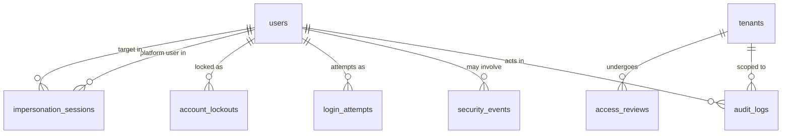

# Schema — Security and Audit

## `audit_logs`

**Purpose:** append-only record of every security-sensitive action across the system — the primary evidence trail for the entire authorization model.

| Column | Type | Constraints |
|---|---|---|
| id | UUID | PK |
| occurred_at | TIMESTAMPTZ | NOT NULL, DEFAULT now() |
| actor_user_id | UUID | NULL |
| effective_user_id | UUID | NULL |
| tenant_id | UUID | NULL |
| action | TEXT | NOT NULL |
| resource_type | TEXT | NULL |
| resource_id | UUID | NULL |
| before_state | JSONB | NULL |
| after_state | JSONB | NULL |
| result | TEXT | NOT NULL |
| failure_reason | TEXT | NULL |
| ip | INET | NULL |
| user_agent | TEXT | NULL |
| request_id | UUID | NULL |
| correlation_id | UUID | NULL |
| impersonation_session_id | UUID | NULL |
| metadata | JSONB | NOT NULL, DEFAULT `'{}'` |

- **Check:** `result IN ('success','denied','error')`
- **FK:** `actor_user_id`/`effective_user_id` → `users(id)` (no `ON DELETE CASCADE` — a user's hard-delete/anonymization must not delete their audit trail; use `ON DELETE SET NULL` with the ID additionally preserved in `metadata` if needed for compliance, or retain via `ON DELETE RESTRICT` and let the anonymization job scrub the `users` row's PII instead of removing the row); `tenant_id` → `tenants(id)` similarly non-cascading; `impersonation_session_id` → `impersonation_sessions(id)`
- **Indexes:** `ix_audit_logs_tenant_occurred ON (tenant_id, occurred_at DESC)`; `ix_audit_logs_actor_occurred ON (actor_user_id, occurred_at DESC)`; `ix_audit_logs_action`
- **Tenant scoping:** `tenant_id IS NULL` for platform-scope actions; when set, standard RLS applies for tenant-facing audit views (`tenant.audit.view`), while `platform.audit.view` reads across all tenants via the platform service layer
- **Deletion behavior:** **no deletion path for the application.** The `app_tenant`/`app_platform` DB roles are granted `INSERT` only on this table — no `UPDATE`, no `DELETE` — enforced at the PostgreSQL `GRANT` level, not just application logic, which is the concrete mitigation for the threat-model's repudiation risk ([03-threat-model.md](03-threat-model.md)). Only a separate, tightly-controlled retention/archival job (running as a distinct maintenance role) may move expired rows to cold storage.
- **Audit:** N/A (this table *is* the audit mechanism)
- **Retention:** long retention per compliance regime (commonly 1–7 years); table is a strong candidate for monthly range partitioning given write volume and time-based access patterns (an operational detail for Phase 9)

## `security_events`

**Purpose:** security-relevant signals that feed alerting — distinct from routine audit entries in that these represent *anomalies* (refresh-token reuse, impossible travel, repeated MFA failure, MFA disabled) rather than ordinary authorized actions.

| Column | Type | Constraints |
|---|---|---|
| id | UUID | PK |
| occurred_at | TIMESTAMPTZ | NOT NULL |
| user_id | UUID | NULL |
| tenant_id | UUID | NULL |
| event_type | TEXT | NOT NULL |
| severity | TEXT | NOT NULL |
| details | JSONB | NOT NULL, DEFAULT `'{}'` |
| ip | INET | NULL |
| user_agent | TEXT | NULL |
| resolved_at | TIMESTAMPTZ | NULL |
| resolved_by_user_id | UUID | NULL |

- **Check:** `severity IN ('info','warning','critical')`
- **Indexes:** `ix_security_events_severity_occurred ON (severity, occurred_at DESC)`; `ix_security_events_user_id`
- **Tenant scoping:** `tenant_id IS NULL` for platform-wide events; standard RLS when set
- **Deletion behavior:** append-only in the same spirit as `audit_logs`, though `resolved_at`/`resolved_by_user_id` are legitimately updatable (investigation workflow) — `UPDATE` is granted narrowly to those two columns only via a column-level `GRANT`, not table-wide
- **Audit:** the creation of a `security_events` row is itself often paired with an `audit_logs` entry when it results in an action (e.g., forced logout)
- **Retention:** per compliance policy, typically as long as `audit_logs`

## `login_attempts`

**Purpose:** every login attempt, successful or not — feeds rate-limiting/lockout decisions and forensic investigation.

| Column | Type | Constraints |
|---|---|---|
| id | UUID | PK |
| occurred_at | TIMESTAMPTZ | NOT NULL |
| email_attempted | CITEXT | NOT NULL |
| user_id | UUID | NULL |
| result | TEXT | NOT NULL |
| ip | INET | NULL |
| user_agent | TEXT | NULL |

- **Check:** `result IN ('success','invalid_credentials','locked','mfa_failed')`
- **Indexes:** `ix_login_attempts_email_occurred ON (email_attempted, occurred_at DESC)`; `ix_login_attempts_ip_occurred ON (ip, occurred_at DESC)` — both are the hot-path lookups for rate-limit/lockout logic
- **Tenant scoping:** none — authentication happens before any tenant is resolved
- **Deletion behavior:** hard delete via periodic purge; high write volume makes indefinite retention impractical
- **Audit:** aggregated into `security_events` on threshold breach (e.g., N failures triggers a `security_events` row), not audited individually beyond this table
- **Retention:** ~90 days, then purged or rolled up into aggregate metrics

## `account_lockouts`

**Purpose:** active/historical lockout state for a user.

| Column | Type | Constraints |
|---|---|---|
| id | UUID | PK |
| user_id | UUID | NOT NULL, FK → users(id) ON DELETE CASCADE |
| locked_at | TIMESTAMPTZ | NOT NULL |
| unlock_at | TIMESTAMPTZ | NULL |
| reason | TEXT | NOT NULL |
| failed_attempt_count | INT | NOT NULL |
| unlocked_by_user_id | UUID | NULL |
| unlocked_at | TIMESTAMPTZ | NULL |

- **Indexes:** `ix_account_lockouts_user_id`
- **Tenant scoping:** none
- **Deletion behavior:** retained as history; not purged alongside `login_attempts` since lockout events are lower volume and higher forensic value
- **Audit:** lockout and manual unlock are FR-AUDIT events
- **Retention:** long retention (security-incident relevant)

## `access_reviews`

**Purpose:** periodic "who has access to what" certification campaigns (SOC2/ISO27001-style access recertification), at platform or tenant scope.

| Column | Type | Constraints |
|---|---|---|
| id | UUID | PK |
| tenant_id | UUID | NULL, FK → tenants(id) ON DELETE CASCADE |
| scope | TEXT | NOT NULL |
| initiated_by_user_id | UUID | NOT NULL, FK → users(id) |
| status | TEXT | NOT NULL, DEFAULT `'in_progress'` |
| started_at | TIMESTAMPTZ | NOT NULL |
| completed_at | TIMESTAMPTZ | NULL |
| summary | JSONB | NULL |

- **Check:** `scope IN ('platform','tenant')`; `status IN ('in_progress','completed')`
- **Tenant scoping:** standard when `tenant_id` set; platform-scope reviews only visible to platform auditors
- **Deletion behavior:** never deleted — a review is itself a compliance artifact
- **Audit:** review initiation/completion is itself an `audit_logs` entry
- **Retention:** long retention, matches compliance evidence requirements

## `impersonation_sessions`

**Purpose:** the record of a platform-support impersonation session, as designed in [06-authorization-model.md](06-authorization-model.md).

| Column | Type | Constraints |
|---|---|---|
| id | UUID | PK |
| platform_user_id | UUID | NOT NULL, FK → users(id) |
| target_user_id | UUID | NOT NULL, FK → users(id) |
| tenant_id | UUID | NOT NULL, FK → tenants(id) |
| reason | TEXT | NOT NULL |
| approval_status | TEXT | NOT NULL, DEFAULT `'not_required'` |
| approved_by_user_id | UUID | NULL |
| started_at | TIMESTAMPTZ | NOT NULL |
| expires_at | TIMESTAMPTZ | NOT NULL |
| ended_at | TIMESTAMPTZ | NULL |
| ip | INET | NULL |
| session_id | UUID | NULL, FK → sessions(id) |

- **Check:** `approval_status IN ('not_required','pending','approved','denied')`; `ck_impersonation_target_membership` validated at the application layer (target must hold an active membership in `tenant_id`) rather than a DB constraint, since it's a cross-table business rule evaluated at session-start time
- **Indexes:** `ix_impersonation_sessions_platform_user_id`; `ix_impersonation_sessions_target_user_id`
- **Tenant scoping:** always tied to exactly one tenant; visible to that tenant's own audit view (tenant-visible impersonation record, Phase 1 §11) in addition to the platform-wide view
- **Deletion behavior:** never deleted — permanent compliance record
- **Audit:** start and end are both `audit_logs` entries; every action taken during the session carries `impersonation_session_id` on its own `audit_logs` row
- **Retention:** long retention, matches `audit_logs`

## `policy_decisions`

**Purpose:** a *sampled* trace of authorization decisions (not full request volume — that would be prohibitively large) used for "why was I denied" support diagnosis and as the natural integration point for a future external policy engine's decision trace.

| Column | Type | Constraints |
|---|---|---|
| id | UUID | PK |
| occurred_at | TIMESTAMPTZ | NOT NULL |
| actor_user_id | UUID | NOT NULL |
| tenant_id | UUID | NULL |
| permission_code | TEXT | NOT NULL |
| resource_type | TEXT | NULL |
| resource_id | UUID | NULL |
| decision | TEXT | NOT NULL |
| reason_code | TEXT | NOT NULL |
| permission_version_used | TEXT | NULL |
| latency_ms | INT | NULL |

- **Check:** `decision IN ('allow','deny')`
- **Indexes:** `ix_policy_decisions_actor_occurred ON (actor_user_id, occurred_at DESC)`
- **Tenant scoping:** standard when `tenant_id` set
- **Deletion behavior:** hard delete via short-retention purge (this is a debugging/observability aid, not a compliance record — `audit_logs`/`security_events` are the compliance record)
- **Audit:** N/A
- **Retention:** short (e.g. 14–30 days); sampling rate and retention are an operational tuning decision for Phase 9

`reason_code` values (`role_grant`, `override_deny`, `entitlement_missing`, `membership_suspended`, etc.) map directly onto the conflict-resolution table in [06-authorization-model.md](06-authorization-model.md), so a denial can always be explained in terms of which step of the effective-permission algorithm produced it.
