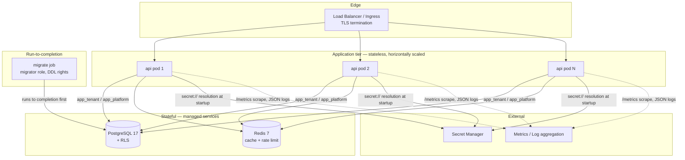

# Deployment & Operations

Phase 9. Covers how this service is built, configured, migrated, observed, and recovered. Companion to [21-configuration-and-secrets.md](21-configuration-and-secrets.md) (what the settings *are*) — this document is about what happens at deploy and run time.

## Deployment topology



The application tier is **stateless** — no local session storage, no sticky sessions, no on-disk state. Sessions live in Postgres, cache in Redis. That is what makes horizontal scaling and rolling deploys safe, and it is a property to protect: anything that introduces per-pod state breaks both.

## The container image

`Dockerfile` is multi-stage. Properties that matter, each verified rather than assumed:

| Property | Why | How it's achieved |
|---|---|---|
| No build toolchain at runtime | `argon2-cffi`/`asyncpg` need `gcc` to build; shipping it adds attack surface for zero benefit | compiled in the `builder` stage, only the venv is copied forward |
| No dev dependencies | `pytest`/`ruff`/`mypy` in a runtime image are pure attack surface | `pip install .` without the `[dev]` extra |
| Non-root | limits what a compromised process can do | `USER app` (uid 1001), `nologin` shell, app files owned by root |
| No secrets in layers | anything copied into a layer is recoverable from the image even if later deleted | `.dockerignore` excludes `.env`, `*.pem`, `*.key` |
| Read-only root filesystem | blocks a compromised process writing tooling to disk | `read_only: true` + `tmpfs: /tmp` in compose |

The image's `HEALTHCHECK` probes `/livez` **only**. A container-level healthcheck that probed dependencies would restart the container during a database blip — turning a recoverable dependency failure into an application outage. See the health-endpoint semantics below.

## Health endpoints — three questions, three answers

Conflating these is the classic deployment bug, so they are deliberately distinct ([api/v1/system/router.py](../src/iam_platform/api/v1/system/router.py)):

| Endpoint | Question | Touches dependencies? | Orchestrator use |
|---|---|---|---|
| `/livez` | Is this process wedged? | **No** | liveness probe → restart pod |
| `/readyz` | Should this pod get traffic *now*? | Yes — Postgres (both roles) + Redis | readiness probe → add/remove from load balancer |
| `/healthz` | Simple aggregate | Yes | human/uptime checks |

**Why `/livez` must never probe dependencies:** if the database goes down and liveness fails, Kubernetes restarts *every pod simultaneously*. The dependency is still down, the restarts don't help, and now you've also lost all warm connection pools and in-flight requests. Liveness answers "is this process broken", readiness answers "can this process serve" — only the latter should depend on the outside world.

`/readyz` probes both database roles separately: `app_tenant` and `app_platform` use different credentials and can fail independently. A pod that can serve tenant traffic but not platform traffic is degraded and should say so.

Probes are bounded (5s timeout) and run concurrently — readiness is called every few seconds per pod and must not itself become a load source or block the event loop on a slow-but-not-dead dependency. The bound is sized for a *cold* connection pool: the first Postgres connect measures ~2.5s and the first Redis ping ~2.2s, against ~0.1s and ~0.002s once warm.

> **Don't assert on `/healthz` in tests that aren't about health.** Because `/healthz` and `/readyz` genuinely depend on Postgres and Redis, any test that treats a 200 from them as a precondition becomes flaky under connection contention — a cold pool's first probe can exceed the timeout for reasons unrelated to what's being tested. This bit the security-header test, which used `/healthz` purely as "any endpoint" and started failing intermittently once Phase 9 made it dependency-aware; it now uses `/livez`, which is guaranteed dependency-free. The degraded-response behaviour itself is covered deterministically in `tests/api/test_ops_endpoints.py` with a stubbed failing health check.

> **Phase 9 finding.** All three endpoints previously returned a hard-coded `"ok"`. A readiness probe that cannot fail is worse than none: it actively suppresses the orchestrator's ability to route around a broken pod.

## Migration strategy

**Migrations run as a separate job, never from the application container.** This is a security boundary, not a convenience:

- The migrate job runs as the **migrator role** (table owner, DDL rights).
- The app runs as `app_tenant` / `app_platform`, which have no DDL rights at all.
- If the app container could migrate, a compromised application process could `DROP POLICY` and defeat RLS entirely.

Ordering, enforced in `docker-compose.prod.yml` via `service_completed_successfully` (and by an init-container or pre-deploy hook on an orchestrator):

```
migrate job → runs to completion → app pods start
```

A failed migration blocks the rollout rather than leaving pods running against a stale schema.

### Expand/contract for zero-downtime

During a rolling deploy, **old and new code run against the same database simultaneously**. Any single migration must therefore be compatible with both. The three-phase pattern:

| Phase | Deploy | Migration | Safe because |
|---|---|---|---|
| **Expand** | — | add nullable column / new table / new index `CONCURRENTLY` | old code ignores what it doesn't know about |
| **Migrate** | new code that writes both old and new | backfill | both shapes are populated |
| **Contract** | new code that reads only new | drop old column, add `NOT NULL` | no running code references the old shape |

Never combine expand and contract in one release. Specifically avoid in a single step: renaming a column, adding `NOT NULL` without a default to a populated table, dropping anything the previous release still reads, or a non-`CONCURRENTLY` index build on a large table (it takes an `ACCESS EXCLUSIVE` lock and stalls writes).

### RLS policies are migration content

RLS policies are hand-written SQL in migrations, not captured by SQLAlchemy metadata and therefore **invisible to `alembic revision --autogenerate`** ([18-schema-rls-and-migrations.md](18-schema-rls-and-migrations.md)). Any migration adding a tenant-owned table must add its policies explicitly. The RLS proof suites (`tests/integration/db/`) are what catch an omission — run them against a migrated staging database before promoting.

Grants are the same category of invisible: `ALTER DEFAULT PRIVILEGES` grants full CRUD on every newly created table, so a new append-only table needs an explicit `REVOKE` (this is exactly how the `audit_logs` gap in Phase 8 arose).

## Secrets

Resolution happens once at startup, before anything reads a credential ([infrastructure/secrets/resolver.py](../src/iam_platform/infrastructure/secrets/resolver.py)):

```
Settings() from env/.env   →   resolve secret:// refs via SecretProvider   →   wire container
```

A value like `DATABASE__PASSWORD=secret://prod/db/password` triggers a fetch; a plain value passes through untouched, keeping local development friction-free. A missing secret raises at startup, so a bad reference fails the deploy at container start rather than at first request.

`ENVIRONMENT=production` with `SECRET_PROVIDER=env` **refuses to start** — that combination means production secrets are sitting in plain environment variables. Verified behaviour, not just intent:

```bash
docker run --rm -e ENVIRONMENT=production -e SECRET_PROVIDER=env ... iam-platform
# pydantic ValidationError: refusing to start: environment=production requires a real secret provider
```

Implemented providers: `env` (development) and `aws_secrets_manager`. `vault`, `azure_key_vault`, and `gcp_secret_manager` are accepted by `Settings` but have no adapter — selecting one raises `NotImplementedError` at startup rather than silently falling back to `env`.

### Key rotation

| Secret | Rotation approach |
|---|---|
| JWT signing key | Publish the new public key alongside the old, sign with the new, keep verifying with both for at least one access-token TTL (15 min), then retire the old. Requires JWKS-style multi-key verification — **not yet implemented**; today a rotation invalidates outstanding access tokens. |
| DB passwords | Rotate in the secret manager, then restart pods (resolution is startup-only). No app change. |
| `ENCRYPTION__DATA_KEY` | **Cannot be rotated without re-encrypting stored provider credentials** — Fernet ciphertexts are bound to the key. A rotation procedure needs a key-versioned envelope scheme; the `CredentialEncryptor` port boundary exists so this changes one file, but it is not built. |

## Observability

**Logs** — structured JSON on stdout ([core/logging.py](../src/iam_platform/core/logging.py)), enriched with `correlation_id` and `request_id` from the bound `RequestContext`, with a sensitive-key redaction list. Collected by the platform's log agent; never written to files inside the container.

**Metrics** — Prometheus exposition at `/metrics`: request counts and latency histograms labelled by method, **route template**, and status. The route *template* rather than the raw path is deliberate — labelling by path would mint a time series per tenant/resource UUID and eventually take down the metrics backend. Unmatched paths collapse to `unmatched` so a URL scanner can't create unbounded cardinality.

`/metrics` is unauthenticated (scrapers don't hold bearer tokens) and must therefore be **blocked at the ingress** for external traffic — expose it only on the internal network or a separate port. It is exempt from rate limiting, along with the health endpoints.

**Correlation** — `X-Correlation-Id` is accepted from the client (or generated), echoed back, and attached to every log line and audit row, so a client-reported error can be traced to server-side records.

**Not built:** distributed tracing (OpenTelemetry spans). The correlation ID gives request-level joining across logs; spans across service boundaries would matter once there is more than one service.

## Rate limiting

Two independent layers, deliberately not collapsed:

| Layer | Scope | Where | Catches |
|---|---|---|---|
| Edge | per-IP, all endpoints | `api/middleware/rate_limit.py` | one source flooding the service |
| Login throttle | per-account, progressive → lockout | `application/identity` | attempts spread across many IPs at one account |

An attacker spreading attempts across many accounts from one IP is caught by the first; one spreading across many IPs against a single account is caught by the second. Either alone leaves a gap.

The edge limiter **fails closed** — a Redis error returns 503, not a bypass ([06-authorization-model.md](06-authorization-model.md): Redis "fails closed (deny) if it can't confirm freshness, never fails open"). A limiter that fails open is worth little: an attacker who can pressure Redis gets unlimited requests exactly when the service can least absorb them.

`forwarded_allow_ips` must be narrowed to the actual proxy CIDR in production. The default `"*"` trusts `X-Forwarded-For` from anyone, letting a client spoof their own rate-limit bucket.

## Graceful shutdown

On `SIGTERM`: uvicorn stops accepting new connections, drains in-flight requests (20s budget), then the app's lifespan disposes both engine pools, the Redis pool, and the HTTP client.

The orchestrator's termination grace period **must exceed** uvicorn's `timeout_graceful_shutdown`, or the drain is a hard kill regardless. Compose sets `stop_grace_period: 30s` against a 20s drain.

> **Phase 9 finding.** Nothing previously disposed these resources. In a rolling deploy, terminating pods held Postgres connections until the server timed them out, so new pods contended for a connection budget the old ones hadn't released.

## Scaling and capacity

The binding constraint is usually **Postgres connections**, not CPU. Each pod opens up to `pool_size + pool_max_overflow` connections **per engine**, and there are two engines:

```
max connections ≈ pods × 2 × (pool_size + pool_max_overflow)
```

At the defaults (10 + 20) that is 60 connections per pod — 20 pods would exhaust a default `max_connections = 1000` server. Either lower the pool sizes or put PgBouncer in front.

**PgBouncer caveat:** transaction-mode pooling is compatible with this codebase specifically because tenant context uses `set_config(..., true)` (transaction-scoped) rather than session-scoped `SET`. Session-scoped state would leak across clients under transaction pooling — this is the same property that scenario 12 in the threat model tests.

**Every authenticated request costs two indexed primary-key lookups** (`users`, `sessions`) in `api/deps/authn.py`'s session-freshness check. That is deliberate and not removable without losing the guarantee it provides: a valid JWT signature only proves the token was issued before it expired, so without this check `logout-all`, password change, account suspension and account deletion have no effect until the access token expires on its own — which is exactly the window that matters when you suspend someone for cause. docs/06 anticipates folding it into the (still-deferred) Redis permission cache; do that before optimising it away.

## Failure modes

Extends the table in [06-authorization-model.md](06-authorization-model.md) with operator actions.

| Failure | Behaviour | Operator action |
|---|---|---|
| Redis down | `/readyz` fails → pod removed from LB. Rate limiter fails closed (503) | Restore Redis. Cache is derived; no data loss. |
| Postgres primary down | `/readyz` fails on both DB probes → all pods pulled | Failover to replica; app reconnects via pool. No stale-cache serving. |
| Migration fails mid-deploy | Migrate job exits non-zero; app pods never start | Old pods keep serving. Fix forward — see rollback note below. |
| Secret manager unreachable at startup | Pod fails to start (resolution raises) | Existing pods unaffected. Restore access before scaling. |
| Slow dependency (not down) | Readiness probes time out at 2s → pod pulled | Investigate; probe timeout is deliberately shorter than typical LB timeouts. |
| Rate-limit false positives behind a proxy | All traffic buckets to the proxy IP | `forwarded_allow_ips` is misconfigured — narrow it to the proxy CIDR. |

### Rollback

**Application rollback** is safe: pods are stateless, so redeploying the previous image is sufficient.

**Database rollback is not symmetric.** Alembic `downgrade` exists but is a last resort — a downgrade that drops a column destroys data written since the upgrade. Prefer fixing forward. This is precisely why the expand/contract discipline matters: if every migration is backward-compatible with the previous release, rolling the *application* back never requires rolling the *database* back.

## Pre-deploy checklist

```bash
# 1. Static + test gates (must all be clean)
python -m ruff check src tests && python -m mypy src && lint-imports && python -m pytest

# 2. Image builds and is hardened
docker build -t iam-platform:$TAG .
docker run --rm iam-platform:$TAG id          # expect uid=1001(app), NOT root

# 3. Migration applies cleanly against a staging clone
python -m alembic upgrade head

# 4. RLS survived the migration — the proof suites, against staging
python -m pytest tests/integration/db tests/security -q

# 5. Config guard actually fires
docker run --rm -e ENVIRONMENT=production -e SECRET_PROVIDER=env ... iam-platform:$TAG
# expect: refusing to start
```

Step 4 is not optional. RLS policies and grants are invisible to autogenerate, so a schema change is exactly when tenant isolation is most likely to silently regress.

## Known gaps

Recorded here rather than left implicit:

- ~~**No `workers/` runtime.**~~ **Built in Phase 11** — a Celery app over the existing Redis (`src/iam_platform/workers/`), currently carrying one job (document ingestion). Threat-model scenario 8 is now fully covered by `workers/job_context.py`'s per-job re-validation. **It is a separate process and must be deployed as one:** `celery -A iam_platform.workers.main:celery_app worker`. Nothing else in the system runs it, so a deployment that starts only the API will accept uploads and leave every document sitting in `processing` forever. Async purges are still not built.

  **Three things the worker image needs that the API image does not**, all found by actually running a PDF through a worker rather than by reading the code:

  1. **No C++ compiler is available at runtime, and docling wants one.** Its layout model runs through TorchInductor, which *generates and compiles C++ when a document is parsed* — not at build time. This image deliberately carries no compiler (that is the whole point of the builder-stage split), so the compiled path cannot work here: every PDF, DOCX, XLSX, PPTX and image would fail with `InvalidCxxCompiler` while CSV/JSON/XML kept working — a partial failure that reads like a bad file rather than a bad deployment. `TORCH_COMPILE_DISABLE=1` is set in the `Dockerfile` and by `infrastructure/parsing/rich_documents.py` for non-container runs. Note that `TORCHDYNAMO_DISABLE`, the name most search results give, is **silently ignored** by torch 2.x — if you ever need to verify the setting took, check `torch._dynamo.config.disable`, not the environment.
  2. **Docling's models are baked into the image at build time** (`HF_HOME=/opt/models/huggingface`). Left to the default they are fetched from Hugging Face on first parse, into a cache that dies with the container — so every pod restart re-downloads several hundred megabytes, and a worker on a network with no egress to `huggingface.co` can never parse a rich document at all. If your workers run without that egress, also set `HF_HUB_OFFLINE=1` so a missing model fails immediately instead of stalling on a fetch that cannot succeed.
  3. **The image carries ~1 GB of CUDA libraries it will never use.** The default PyPI `torch` wheel bundles `nvidia-cudnn`, `nvidia-nccl`, `nvidia-cublas`, `triton` and friends; inference here is CPU-only. Installing torch from `https://download.pytorch.org/whl/cpu` would cut image size, build time and pull time substantially. Not done yet — it invalidates the (expensive, ~45 minute) cached dependency layer, so it belongs in a change made for that reason rather than as a side effect of another one.
- **JWT signing-key rotation** needs multi-key (JWKS) verification; today rotation invalidates outstanding access tokens.
- **`ENCRYPTION__DATA_KEY` rotation** requires a key-versioned envelope scheme and re-encryption of stored credentials.
- **No distributed tracing.**
- ~~**Vector store and object storage are in-memory/logging stand-ins.**~~ **Replaced in Phase 10** — real Qdrant (`infrastructure/vector/qdrant_search.py`, collection-per-tenant) and real object storage (local filesystem or Cloudflare R2, `infrastructure/storage/`). An *unconfigured* deployment gets `UnconfiguredVectorSearchClient`, which raises rather than falling back to the in-memory fake: a fake would answer every search with an empty result set, indistinguishable from a knowledge base with genuinely no matches and invisible in logs.
- **The image carries a browser, and that is deliberate.** `playwright install --with-deps chromium` is baked in at build time under `PLAYWRIGHT_BROWSERS_PATH=/opt/playwright`, because `pip install playwright` installs the client and *not* the browser — without it, website crawling raises at crawl time in production while file uploads keep working. One image serves both the API and the worker, so the API carries ~400 MB it never uses; splitting them is the obvious optimisation if image size starts to matter, and is not worth the second Dockerfile today.
- **Platform-default model configurations are unreachable** (schema defect, found while building the admin console). [16-schema-ai-resources.md](16-schema-ai-resources.md) describes `model_configurations` rows with `tenant_id IS NULL` as "readable by all tenants", but `ai_assistants` carries a plain composite FK `(tenant_id, model_configuration_id) → model_configurations(tenant_id, id)` and its own `tenant_id` is `NOT NULL` — so a tenant's assistant can only ever reference a configuration owned by that same tenant, and inserting one that points at a platform default fails on `fk_ai_assistants_model_configuration`. Phase 6 hit the identical nullable-tenant problem with `tenant_roles` and solved it with a single-column FK (`fk_tenant_membership_roles_role_id`); `ai_assistants` was never given the same treatment. Fixing it needs an expand/contract migration replacing that composite FK. Until then, every model configuration must be tenant-scoped.
- **`docker-compose.prod.yml` is a reference topology**, not a production target. Real deployments use an orchestrator with managed datastores.
- **No session-enumeration endpoint.** `sessions` and `refresh_tokens` are stored and revocable in bulk (`POST /v1/auth/logout-all`), but nothing lists them, so the admin console can offer "sign out everywhere" and not a per-device session view.
- **Pagination exists only on `GET /v1/platform/users`.** Every other list endpoint returns its full result set. Fine at current scale; the user directory was singled out because `users` is the one table this system is explicitly sized for millions of rows.
- **No real email provider.** `ConsoleEmailSender` (`infrastructure/email/console_sender.py`) only logs "email queued" — registration verification and password-reset emails are never actually delivered, in any environment including production. Until a real provider (SES, SendGrid, etc.) is wired in behind the existing port, activating an account requires direct database access; `scripts/bootstrap_platform_admin.py` does this for the first platform administrator (see [../DEPLOYMENT.md](../DEPLOYMENT.md)).
